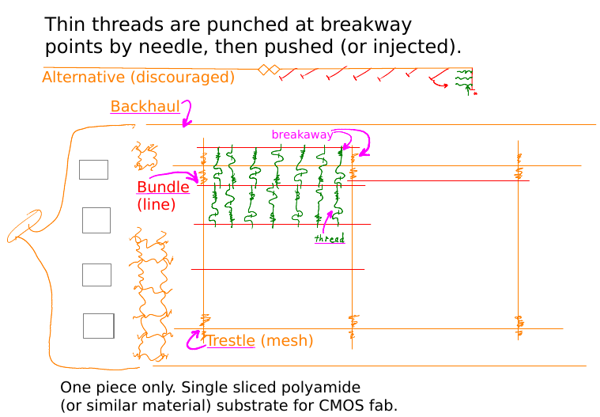

<!-- scriptedIllustrator_markup_uk4uPhB663kVcygT0q 
#exit # scriptedIllustrator_markup_uk4uPhB663kVcygT0q 
# <html style="size: letter;"> <!-- scriptedIllustrator_markup_uk4uPhB663kVcygT0q
#!/usr/bin/env bash

# Dependencies.
# May need 'ubiquitous_bash.sh" in "$PATH".
# GNU Octave, Qalculate - usually dependency of 'calculator' scripts
# recode - usually dependency of 'markup documentation' scripts
# wkhtmltopdf - may be necessary for accurate conversion from HTML to PDF

# NOTICE: README !
# 
# 
# 
# NOTICE: README !

# CAUTION: As a user, you should have been provided a virtual machine or cloud services to run this script - 'ubiquitous bash' provides functions to ease the use of either and both. An SELinux, AppArmor, unprivileged ChRoot, or similar context may be acceptable as well. Routinely modifying, sharing, and running code, may otherwise put both users and organizations at possibly unnecessary risk.

# Copyright and related rights only waived via CC0 if all specified conditions are met.
# *) EITHER, a single file directly output from 'scriptedIllustrator' (which is GPLv3 licensed), OR, not otherwise claimed under other any copyright license.
# *) Is a documentation script including this message which also predominantly creates or represents markup (eg. 'scriptedIllustrator.sh', 'scriptedIllustrator.html', 'scriptedIllustrator.mediawiki.txt').
# *) NOT part of a program to compress, embed, and assemble, functions and other code (waiver does NOT apply to 'tinyCompiler_scriptedIllustrator.sh' ).

# To the extent possible, related software (ie. 'tinyCompiler_scriptedIllustrator.sh' from 'scriptedIllustrator') remains otherwise copyrighted (ie. GPLv3 license).
# Specifically, please do not use 'scriptedIllustrator' code to distribute unpublished proprietary means of creating 'current_internal_CompressedFunctions' .
# Specifically, please do not misconstrue this copyright waiver to negate any copyright claimed when such a documentation script is part of another project or another copyright notice is present (ie. 'otherwise claimed').

# 'For the avoidance of doubt, any information that you choose to store within your own copy' ... 'remains yours' ... 'using' ... 'to publish content doesn't change whatever rights you may have to that content.'
# Although this project has no relation to TiddlyWiki, as stated above, vaguely similar copyright principles are expected to apply. - https://tiddlywiki.com/static/License.html

#__README_uk4uPhB663kVcygT0q_README__

_document_collect() {
# NOTICE: COLLECT

# Not necessary. Warnings about 'command not found' to 'stderr' will be ignored by script pipelines.
#! type -p 'recode' > /dev/null 2>&1 && recode() { false; }

currentByte=8

RECODE_markup_html_pre_begin=$(_safeEcho "$markup_html_pre_begin" | recode ascii..html)

export current_lorem_ipsum='Lorem ipsum dolor sit amet, consectetur adipiscing elit, sed do eiusmod tempor incididunt ut labore et dolore magna aliqua. Ut enim ad minim veniam, quis nostrud exercitation ullamco laboris nisi ut aliquip ex ea commodo consequat. Duis aute irure dolor in reprehenderit in voluptate velit esse cillum dolore eu fugiat nulla pariatur. Excepteur sint occaecat cupidatat non proident, sunt in culpa qui officia deserunt mollit anim id est laborum.'

# NOTICE: COLLECT
}

_document_main() {
#a
#b
# NOTICE: DOCUMENT
#__HEADER_uk4uPhB663kVcygT0q_HEADER__
_t '
scriptedIllustrator_markup_uk4uPhB663kVcygT0q --><!-- # --><pre style="margin-top: 0px;margin-bottom: 0px;white-space: pre-wrap;">
Copyright (C) 2021,2022- mirage335
See the end of the file for license conditions.
See license.txt for mirage335_author license conditions.

Resume, recruiting, policy, demos, etc, regarding &#39;author&#39; 
mirage335.
<!-- # --></pre><!-- scriptedIllustrator_markup_uk4uPhB663kVcygT0q
'
_t '
scriptedIllustrator_markup_uk4uPhB663kVcygT0q --><!-- # --><pre style="margin-top: 0px;margin-bottom: 0px;white-space: pre-wrap;">

<!-- # --></pre><!-- scriptedIllustrator_markup_uk4uPhB663kVcygT0q
'
 '_heading1' 'Reading'
if false; then true; # -->
<!-- # --><h1>Reading</h1>
<!--
fi
 '_picture' 'zzLib_895-reference/demo/TazStiff_owner.jpg' '25%'
if false; then true; # -->
<!-- # -->
<!--
fi
_t '
scriptedIllustrator_markup_uk4uPhB663kVcygT0q --><!-- # --><pre style="margin-top: 0px;margin-bottom: 0px;white-space: pre-wrap;">
Recommended reading includes...
* document-biography.pdf
* document-recruiting-complete.pdf
* document-numbering.pdf
* zzLib_895-reference/from_uTST (image gallery)
* zzLib_895-reference/demo (image gallery)
* zzLib_895-reference/demo/_misc (image gallery)
<!-- # --></pre><!-- scriptedIllustrator_markup_uk4uPhB663kVcygT0q
'
_r '
scriptedIllustrator_markup_uk4uPhB663kVcygT0q -->
<iframe src="./index.html" width=95% height=720></iframe>
<!-- scriptedIllustrator_markup_uk4uPhB663kVcygT0q
'
 '_image' 'zzLib_895-reference/from_uTST/neuralBits-zEXCERPTED-diagram-picture.png' '40%'
if false; then true; # -->
<!-- # -->
<!--
fi
 '_image' 'zzLib_895-reference/from_uTST/sleeveDive-extraction.png' '60%'
if false; then true; # -->
<!-- # -->
<!--
fi
 '_picture' 'zzLib_895-reference/from_uTST/problemSolversGuide-amplifier-commonEmitter.png' '20%'
if false; then true; # -->
<!-- # -->
<!--
fi
 '_image' 'zzLib_895-reference/from_uTST/lithoDive-flatTool.png' '80%'
if false; then true; # -->
<!-- # -->
<!--
fi
 '_image' 'zzLib_895-reference/from_uTST/cognitionSplicer-topographicMapping.png' '80%'
if false; then true; # -->
<!-- # -->
<!--
fi
 '_page'
if false; then true; # -->
<!-- # -->
 

<!--
fi
 '_heading1' 'Usage'
if false; then true; # -->
<!-- # --><h1>Usage</h1>
<!--
fi
 '_o' '_messagePlain_probe' './_consolidate_documents.bat'
if false; then true; # -->
<!-- # --><pre style="-webkit-print-color-adjust: exact;background-color:#848484;margin-top: 0px;margin-bottom: 0px;white-space: pre-wrap;">
<!-- # --> ./_consolidate_documents.bat
<!-- # --></pre>
<!--
fi
_t '
scriptedIllustrator_markup_uk4uPhB663kVcygT0q --><!-- # --><pre style="margin-top: 0px;margin-bottom: 0px;white-space: pre-wrap;">
Some larger binary replacement documents (ie. some PDF files) may be 
written to &#39;_bundle/&#39; to avoid unintentionally adding large binary 
object output to git history. Move these files to the root of the 
repository when appropriate.
<!-- # --></pre><!-- scriptedIllustrator_markup_uk4uPhB663kVcygT0q
'
 '_heading1' 'Design'
if false; then true; # -->
<!-- # --><h1>Design</h1>
<!--
fi
_t '
scriptedIllustrator_markup_uk4uPhB663kVcygT0q --><!-- # --><pre style="margin-top: 0px;margin-bottom: 0px;white-space: pre-wrap;">
Mostly uses &#39;scriptedIllustrator&#39; . Some files may use resources 
from other files, using path variables defined by 
&#39;./zzLib_800-documents/consolidateVariables.sh&#39; .
<!-- # --></pre><!-- scriptedIllustrator_markup_uk4uPhB663kVcygT0q
'
 '_heading1' 'Reference'
if false; then true; # -->
<!-- # --><h1>Reference</h1>
<!--
fi
_t '
scriptedIllustrator_markup_uk4uPhB663kVcygT0q --><!-- # --><pre style="margin-top: 0px;margin-bottom: 0px;white-space: pre-wrap;"> 
<!-- # --></pre><!-- scriptedIllustrator_markup_uk4uPhB663kVcygT0q
'
 '_heading1' 'ACKNOWLEDGEMENT - Repository History'
if false; then true; # -->
<!-- # --><h1>ACKNOWLEDGEMENT - Repository History</h1>
<!--
fi
_t '
scriptedIllustrator_markup_uk4uPhB663kVcygT0q --><!-- # --><pre style="margin-top: 0px;margin-bottom: 0px;white-space: pre-wrap;">
In addition to any stated acknowledgements in the documents here, which may 
cite contributors or other works, the repository history may also 
acknowledge authors, contributors, and other works. Normally, explicit 
citations will nevertheless be added to documents here under an 
&#39;acknowledgement&#39; or similar heading, unless the documents are of 
narrow, small, non-research, and/or similar purpose for which such would 
not be usual apparent practice (eg. a &#39;resume&#39;).
<!-- # --></pre><!-- scriptedIllustrator_markup_uk4uPhB663kVcygT0q
'
 '_heading1' 'ACKNOWLEDGEMENT - Contributors'
if false; then true; # -->
<!-- # --><h1>ACKNOWLEDGEMENT - Contributors</h1>
<!--
fi
_t '
scriptedIllustrator_markup_uk4uPhB663kVcygT0q --><!-- # --><pre style="margin-top: 0px;margin-bottom: 0px;white-space: pre-wrap;">
Supplementing any acknowledgements elsewhere of contributors to documents 
here.
* Julia Longtin. Especially for advice and copy editing.
<!-- # --></pre><!-- scriptedIllustrator_markup_uk4uPhB663kVcygT0q
'
 '_heading1' 'Copyright'
if false; then true; # -->
<!-- # --><h1>Copyright</h1>
<!--
fi
_t '
scriptedIllustrator_markup_uk4uPhB663kVcygT0q --><!-- # --><pre style="margin-top: 0px;margin-bottom: 0px;white-space: pre-wrap;">
This file is part of mirage335_author.

mirage335_author is free software: you can redistribute it and/or modify
it under the terms of the GNU Affero General Public License as published by
the Free Software Foundation, either version 3 of the License, or
(at your option) any later version.

mirage335_author is distributed in the hope that it will be useful,
but WITHOUT ANY WARRANTY; without even the implied warranty of
MERCHANTABILITY or FITNESS FOR A PARTICULAR PURPOSE.  See the
GNU Affero General Public License for more details.

You should have received a copy of the GNU Affero General Public License
along with mirage335_author.  If not, see 
&lt;http://www.gnu.org/licenses/&gt;.
<!-- # --></pre><!-- scriptedIllustrator_markup_uk4uPhB663kVcygT0q
'
_t '
scriptedIllustrator_markup_uk4uPhB663kVcygT0q --><!-- # --><pre style="margin-top: 0px;margin-bottom: 0px;white-space: pre-wrap;">

<!-- # --></pre><!-- scriptedIllustrator_markup_uk4uPhB663kVcygT0q
'

#__FOOTER_uk4uPhB663kVcygT0q_FOOTER__
# NOTICE: DOCUMENT
#y
#z
echo -e '\n\n'
}

# NOTICE: Overrides - new functions .

# NOTICE: Overrides - new functions .

#####Functions. Some may be from 'ubiquitous bash' .
#_compressedFunctions_uk4uPhB663kVcygT0q_compressedFunctions_uk4uPhB663kVcygT0q_compressedFunctions_uk4uPhB663kVcygT0q_compressedFunctions
current_internal_CompressedFunctions_bytes="12440"
current_internal_CompressedFunctions_cksum="1448096945"
current_internal_CompressedFunctions="
/Td6WFoAAATm1rRGAgAhARwAAAAQz1jM4cfzI/JdAC+ciKYksL89qRi90TdMvSwSEM6J8ipM2rR/Iqc/oYbShD5P+hKgz3ONSu7BhrUf8OSN4oZ8BL1e7m0JQ33pEQs007VTHA7nLczyIuWiilZSo+0zB132
DrV189uAlZ6oqD3MK7bjrSmuGreEaBOC+z5QkGUPIDVaXfJmDg73/A1Y9JqRKxtli7ZDurfX2t/Z3m6RV6ku3LwPHl2qt8/kbWEubRkY3Fl2VTTFWjQ8Z9qfpBK4YyV7fw3X3hcUmN6Fz+u2P8eCSl/fCnNX
HtvGeiwoJbZ3wje2iPvqVhHoy0BMVkEDcSqWo+znkV0BwqE45qLsZQ9IGG1CzglgciwcOU2fdsqKBFC5XA3WYFGg6uZ2q4mvn5jWR+FbeUz7YjupLAvLl7DE+daOBWzzyYeFrcMhDk1QeqOKpv41V0GTTqAm
Z7lRbPrhk3oRY/kBiQGZSfRuxTSmIc1zevrFy6JWcZkCJayU/wQ+XEKdvF51XHH+OYrSuhIxvk6G+Ce0sbTr3GBfVRQYdRpxeOs48xNaEfmBf6GZcWUMx5L3LA4cup19vL4O75JjKbnlJeYdoRCjtcPE7A8S
82KbKVXWm5n1ADflKsnTX3CVTSu7uS4pVXHlludUnC/0dCPIaO2WxpZTXETnBW0SD0f3HTs7UDEzwk7eMHnoe3xk/cdsh16yyG0jPOBLHEqULsotf/cimpgvkZlFxPNFKvrB2sVBDpjr393u8l5sSqQ9L5Vr
QgGi6nBnxhDESgC1fMuEusvr6Sli1rR/+c0ap1SksGpO2TEUmhLB2btBz2JAuC6RRnqPSeJB5e7Ye3lLZgz7qHahujxIhELZ6Ig37WMvcLn/BMoXxtrpqAx3WQEFwPU+GEqAYIYrxdNFO0vmXqIu7mijEGNN
3Kz52PfEP9wuiJegjzcwG1SjieemTZAy5HeBzXmyNh8NuIdpHzxX83tVQ6zn4W8eFh94YUkd8LPxqapxW9+5Ljru6KBXErt6eoQ1JzryMghYRXroIw6cezM5nO29ERbDgwMaWHM8HHSnsRVwOyHrn3h6dSYW
FRI5yIxuHcZpSxIl+Wcyy7l04D052ZLSwIr3bVXp4Wl8UN43ZjFk500/N03EAhnaDm33ejErcZzg3IyCf9KDULz2vjN1ZMLj0f8szC8Yd5LbbQJ0QaXtts9dioTUAtjmI2n0Nua2iP8U6I2yFW4q1flLmWgw
dwxuvholhSJhoQ1mvtYG9GHKOnerwBFiSgokDlXpGx/wWLEggdJzD83Gsc970UUKaPclxZq9t53+B7POZLqRi9MT1bN4M5xVNF9BpfIOMoXjjfCBdMsMg9KiWzl5MampEj+sO3zuoQacK51dsC8fF1kx/Ipo
T0+57cS1KCKaDzB3/U2HEY855HTDewfULt1Mox+DjNi+SoyNEej/2dvZj2k7gc6F2P4cYp0XlGset9wxtH8+3HkTBns+M9aR3+kzI/CW6vSnkHXti9l/usvJEofd55FM+ZveKRq4OmWB9Oq1ruDmZeB3ti5H
l9Be+OF5pyJ7O4nKeKvq36QuxgvvKFuWDH8YrEDrrLKvQA2ZwqPfB/Dx301jgKu2lHwCC5Cr6asX/Tjo71N7833otVOmbW18/ev2R0aUgZKsqzPZIqFX1x9DpRggWTuQOX49oKJA3lS+k80eCsgjWZ3NwHHB
JNS03KTfjGNYL21M5FopczHLlOKA3NfxtRVtvC3ptJwtqiQYiRhRFdiUmrckYzPNf/WZmL6FouTxTXHf/8KnqYdZ0a/shLqxbCEkIwYD7IZlBIXfZukhiP6kefFP2XGAvV7HC93XH3BC1oYnPQBRcKtLLn5C
zda+MyZGKU7AXhq1EleGh62Y/vDec7Bgz3UwJtR+8YBCdQ8/Xcf4mORqcw5ELeSC/sZESq/ZT4uHAWXlbxnvzRXvDJ58sFyghbkx9mNwpWRFrj39Hq3TTm9NkSX/ExPFblReiwO3+1d5czQOEU8JnpKwbXak
iZTSx0rJ6xz5YqpuDxrnSOA9Ti+KiK6yFVv5gZJsPa9opyNifSPEsLjaULtj3MT0jHSHlwYMPOm3ZU5anWZ9zLnlZDFk+5W9aVR/+HHjmTDgYiD/2lVhvyGFs0RFnIjj0W1Yrr0Qh7RR/STZo3Uj4PsS01jS
XFU1MAfvrY5cOFVq3gGq/BcYNU22RhC4TjfS9SLCd9Rrp8795lN2bSnGVKQ7eCrYdqYvCzLQ5RjV/jRfze8GD8XuJfOitXktggA4TGfdN2an12568jtS+q125ACbgQsG6KbDJ6HDEIk7PfdymVGeLNP58IfV
Ti9a8Wv3gxx1o9cP105zLp3eY+BXgXxpJpM0PwQ9C6SDYTYgWhLyJIL3s80HCWKRoNzfKE5+FpmuIodKb6nrgjQM2iMrkzD1grRPrIweqC2IvgUUp76cXjIWapPPJKoRAis9rOzsqZfOqwe4dCaJPjS7hodF
HOUHrNeKwCtOP73IH4yMLIWcTQkcR4cH2ycD+GoyrsM1KfK8rRf1sA2exEaj1gBbL2X90zTFijyIQp5ACcTa7g2erPu7xNzRNLL4lcAtRuduONBy7H3bokwhxUVT9XYKK6vxOsGBN9rqJ32dBCki2eznhSvG
YY7hDmldozOVzv70Ht4XupfIlhujDJ4CAVyp20SPKzFsyuI5O47AKB7bJ6KeNvsN3dn8PJFniSfpCxiksP4mSGD6c4fFUOKU1sqta3v8sgkEZIxqjtcEVkfWMvK6fVIb6z66P2kDSqBE++icHbYkIr+dczrx
6GLgOXvNFml1WJUyhpmyhkIJzZ/geu6ET9wonX4MZ/NEmC8jxUNFR/hfM+yH2sYL+1K4zI+kNhe0+iPdJYSpbxC3hOlYg5wsF0a72YOfikpkwp+2SdL5ItnyCkVTqMJVpDMSDppFsb1IcSm3oVLlTCOYpQxi
xNDpvrwfzm5INJXutfAgTnsuAAcaEIojAwo9N/+SBWcckzuXDR4OwDi3RV1muOvBjokJxIdAPtWJ+uNEVP0lXh+h0NtQ7ef04SfuYp9LQG1xMkglcvFZ44jp/L5G4NN4WnJJhKab539tSqdbMdDrRiLrsuC4
KjR5btxXS1fZMl/1Xv4pA2SSAavd2VCr1uFRicajnanO8cy48yJGoBNI2W+6In/H5QFwEGi2x7UwEGSFuBn4GlaAiNK7uZDg+hXZygCn03CgvwLsv8MlAfzwG4PVTud+3drmDH1VT1yj/KyUtTuOzC5kwkej
Plm+nWsvIllEV4RpSnA6qxpIM0pqtzYHJkIrk/avJj5RI/48SfDusDhiPCfuNHbuTXqP5Icg+Yy7Haw7JJpzFPHRxVHeNkeDda5D2/izDV9jfczVhajB7YI9W9kn8R56FgHKnNRRj5zE3APEx/Z1cNfZO9QE
w4/T2inDLxP/cS4uorgGK7SJ774XgChWl2DOeU935l13Zn1au8GEP79SKmiiTUuTLYNp9NE4Qszk4tMmoKHXAlV/FU1UzZ81lHdMQAJD5bPf0UYD6Xwm+AEWf2ZE38zLWp/AsFCUfR19vZSqc+exrFoEyoCe
PwMJTQ36wTcP39xZqZieI8gCRT7CmM5HQZr7yqhOsspirM7uQREOEtDrI263hGlL7BpuLLXRAmmtLxuaZmk8ZCONzADTvaZVzltbT+0UEOsnJg2oGb1NwQCZMiUiGZAAdGuUhmKDBm9puMYdNt/yld9tDIwv
oAPIHCv7i5rk5Sxj7f/TmPrNS9F/ijEjMvLhXrIhHyKXqATIhhx61wp4Jc9vECgih7fJjHH9E3IB5aJO83A2r6TwMIUAWVj0LwEZiHn6iwFoHU/rXn4dLtaJJVs6C/M7lsNIbiJokfN0sC8alQlNegzsu2RF
5ERNRi7E+g1pVyHwf06wpuqyadn+v+D+LgN7eeqOnZH3gvjuKeznOvCR9nCJi8aysblRejmLOLGuxFsxWyhLSveK+EQwJXluuxj9Kuh4RbCfzWzSGFG2dD5Vpn9zTND3/xtO8ZlK/oVn76f+CQd5HSCEHCOb
6xkPXLS9mISFXny2cSF7BjGETunl6gQCzVFWJLO4JOL97XneV209AFCHRRF3awzrjjyUtCpiClInBHidhgG9M4YZaFSqexkSpOujl6JxFLR8Jbvl3dY6haZWCyaoXCg+CLhCDauyh4pmzH3wbQCmuohvrLLL
LjjG+TkHd3nNj70i1Jd7lAy3pTR+tv+zKndeqKyzl+RIjjM6SWJrzpmpJiZlNlUqGRo/4ZeYIQTlYSPah/V+00rl4BdP2Wm7B7BbELIF6gyp7qpukhHG75lZj9yuf1u8OzIO9XP9uj/+zdm2TKVm3o1xW08m
RDcKl/Bj+FLxY1GN4bAEzZsBD5hdWG6DNuY1CHoMyjnY+aamd1sV08cprLjR/MxD3+0bnOloLzh6B0ciRdnd923890+QvN3abt+ua4zpgGVcmB2G8wpYIwuMtKt2OMo2h7Ks1uMR0JKIoUZ5vCrQWr3PXz6b
CeMkDLgwinXZw8TLmr3HssTw9pOSecL1hUsy8UamJV2dELhIMNJMEZjS4WlvsguDDgWy227yLnn5FdoOiD+FzC+btipX71/XoFqge0p9b5UjZE6qsCnAWMRDe7EkxRuLU9BxEnT1TnPzDfXab6pbkPOLMRLO
qUIjhZ+qV+uGL0iMBd/M1C38n4CRI5u0/nKEH2jXbnZ50/yzs+A9gukvIbWYG9FtC8uFy/vbi6qEmI0n/yIznG6b4Ycquu52q1eVNlRDmFMqCHxgEWY2JXXxqUiS6xPqRkgIALywOgpOXbMHi60MSnPalEoi
/SO2J2hJ0BQvOFf1h98hEeY4Ze37HIwkIjrl0EyWv7NWnK/pLrCuaG2N3sUgj4JRN+EuxfgEHldJDoztQCOiLJPLly/qzbyyWwN360TArX6a33X9qwoLBQyDWFpN/v6BqeqZYiVRJVF5fYfQDpxTc2rNI4Jv
CWlBXGlCYqaVYT8UVXouU3I3b84jtuN+PGS2BDxTfKB1G1Yqsjjg3SveC4Ag5W3Gis4xedIrW/XgmYnaabwvLu1aRvOG0mgN7I5DzGoBAMD+Wyrc1nuuAScUMeI8VvS9p3xnBIxDeyXxkWR8rc1ei9nmLH28
e166nScoF8JMOe06z07Sfo7aAXw2fBYPorOpyzhCUJXP4KrNHK2yzPTkFi9J7THv/QOaxp2R+1z/fEdSK8LywtCN6t7KKWcBEU9FJw4t3Hiw6MfC6RJiPay9w690f5KGOHz1AX+Tt9dwR8VwfO0udQPWYlNS
CW/T1r9ZozDXXBrqklTJHLyQ3BGp1jzDOhdQMfc6RmvqAClyUsMrMRCZ+d/2anJvCvBicRV/a0GlfOxlj5+odO6pdZdqr2Y5YIxrh/jhG8EMZO+mQ+Oy3il+VZjkjdaKro8XHjXAs0o94pBRd8Fyq2Z2dZ1A
sH9qkUwyqFnNkzvB6eRzJ2jEyy90++OfmRqGc4OBotYF8kk/xoACgha5ipVUhY725SQOseGK6vYHoSKbyoxAk474IB9Jybq67MPJOFIWo603952uUY+cDym8dnP9hfGjebFxo9NTPuCnQveCi+/18KDidVDa
c5PlI/mI671906ktEe/jPHLGbvmTLH0TuZfs9e2+e7DnEbL4sMLH0EawAcwSdFYVynKM9sXRhYoLIOo6xTZP0JP+6wHaPY6HhdvIeSqrBzve2iC2iqxw/5i40UAklR1NXgc+liyqQAa8CQbMjr9LzpHyW3LC
eUzju+UA2uztWZJEcovRH6xy0hQ7D90cXNA64GZFiPiO8nQcm/LVV0hhSxktaOic9Fet+M+MG+H197qzxdFbrlUkCZm4362CP+neBTqADkixjAMdR/f0hRh/oY+x8OZkL3DBeTSG8GzA8EjF5B9LTCRW6Y6j
vicPIIYcKhRRESizwPKwgZO3s5mXSb2txbGe/qwUFGggUcnKHII5ijnWXqk1o6wecO7elP03vPiqmEkzTRJJKsM0SQK5iW3yXS85SgHEBuVTM7sfP6TIi6aI6b179n1rJLCBl0XkvG7aJ64kqhlE4PewTD8Q
9DG1N2NT7nmfAEZIkMMk3k32a58cyJMs9i+uPlZYJR2D2l84WubKA/CibqaTtNdg5DvWLYXE/xVNFFLvkdDSWO3RUmIs9gNrStNAR8ARXOxiOZ9flf+G7U3QdkxlEgl5ZIxIP7ChqBexS1i8jVrHuFaDve7w
CSt9Uy/ZJsKVG9wkdgMpoaQ9ZOjqn2cjcRyrSoY0C2XT/65k9u+6Tq5DoMZSTfyDKOQwiFh2QVI6pxQsUnyCRh2WlXfVldBN7hI3kWb6Ru3P3mTgXDVBeaeeGdMlkeFxSB8xk/qgZxVSgX8VdqZgjXYNpyYP
bdMEWP/d4YMWU/O0lOCeToXae9/fwM9D3vRtCqKc4TCDlsW/88MXzW6tqyS3X1mvp78AUcoHbTBP1SVPBRzPZHr84rr4rezqxcjmDVrJ9UlTx2VXiD+uOBZmlSuJ5aN+sDdsQjRtc0HhgGRg9RB8VwLVxeMH
NYTWeRjp3pWC7Kf0O/77Zly3Ly6jEh/6dFepz5upP7/4904KerSSuVu4+kXqIxaoVpInCCJvNQWcvuWa+nxH6njSY/jceDbCaGtGNpm/04pLcBWEopiL5w7KSCMMtam+cWYe2L+uV9/pHwMEh//EOxj8bf3Q
AnQDXcM9mhM4ux68cDt+j1Z1omhb3W1o+0fqfgD7ZKVtxI+u1med8sLSaJB4fBLIn2ootKTPKjo7fEhc2D2DjmDnpYPYXhSQyrOWf8A1dnOfo8VWC3MrysYyw/5q4ugnhNKE1iySN6rN3DJheTHodPg4Hmxv
daL5KH5swtrTMJq7TvteizSACApEWKbarcQ9kVK0KDe8234dBCaANr3HznipXdiHDismXaTT33eJCENvoRDTf0kqOuaxvn/ISsLyhUW+PMx0O3zsHd4jUdaAbTR3B2dDxbv334SKYeDvwsMFA/9Cr3TL5mAU
xcuMQPCpQgk6ndAgtUZF4YVOCHq3/DFzW7InnoEni2mpvzbd01bbjulWbYhQ2bQnoOyt+7FZr8w5GAHJCE5laSFQRyLCN2JFtDIU7GWswGN3L9NjqqeLZq4VBqO+jkwrL2zsiVdCxOqLMNRXDfWq/IzJ755F
kFpDuKh5DHRM0R9QDBc7TUFxyMoZ9QgdNqxH5ZGOAP/zSlOh3qqI1n5BruhJYoywwSKmjlfWzdRhd4JXwPXRRabKL7EJteAXwdKoZgR56XEcXx1bmjAFZVkNDOUYlHvOjd95UcY1QrpCb0M7E4DWF64gCVKT
mhA1vBWadEpQBksHD4EgLcSlHxUPcWrGLAs//0YY4xl2nHvmsEOsHYkgxLTlCfe68h3yIJ2o1xmJm6O0J0P5tNHfdwMASq9jKgwJVFVO221DSXNHcs8ngyL+/ZocSmPSwbAa1HQT4oq86CDsJgOsi8Kk6pEb
6fpqMmPklOzfyPEEh93gj9EtEwJ6BCXh7J4qrXSzx/dF7puOXE9NK5h+ExToNmMli76RV3WIf0/Z0RhJ4hoLw/ztPzvbdbQl29i5tHrD8yXZC1fd2p/R3yT3kOF30VpFm+GOcgfUT9kjWffbdgoHAMbZVkTd
n+vjPCI7VYwFxwNFVBGU63daPTTTjSL0/UTx5reJV1aGw1I0IjkjqgMwTWA7q0VFJZL+dDPVJSl/kst4h8n3YVO1cGAAG24Aluqyc+HRvuqG0DNqBmM/yH0Nrm+lXhLXqPjsEPY2kjl1eelCXh7FBd3Bh06t
iFw3ll/aTJHFTwYc8scYboALH3OxRES8J7EoqCFPQ0C3EVn42kcBq1FvP1nzA6OKVid1QspNWwmtHEKniCMOtnWcngFdNAFAGZhvyqApihTKcWUJbYC/4LCiE8VXSfsU62/BpRlahZsev8t8GkxBwx4znUV9
x25cfdaNErYbxw4ucDzCPR6MPoWXhEWiQ7qGZ19tXCwro+iVpYO0c1HKbIgrrsUjgZQth+TcrdHRQzpjFauznPAis51YJ+3TgP712xrVRF8v6Xw8dbx+ostTAC2nzOKur8iPv940TktYcLNsjAd0nZ7kkRyQ
KRMXnals3aUjlDdDBzqBGXYeEgKJOixBzdOGbH1NdgpJa1fgG47EDI2a4zR5H1MHQr6Kavpm5cZtBBkHvmjXfzmnp+gXqVMNmYSxiUOBeWn8UJJAs7bKihXUmfkXJXB41UZfFpauLERF4yjG1/mELIyYnVYB
zzpHUWrf0PnEruaFNSqMpfN2B0D2McB0plqCKWMOYF+dqBe3uFSCU9SyXlk2/5aQrQSWqL9JpOrlCZfFs52Z1WGLKH9bjgnM5HHV6WOVpyuFQdZQ9XYtR+cQfDkEGKXwffgM/I6xg1XEFisYwkiivipZQlR5
NUpioKTnfp2KUo4ieCcO8Fp7pVoFdZHP4WqxM4rmxNuMvQcPAvQ728Fx1d5h5O2qVd1d3I3cZYH+/KwsXIJ3k9Qm17qI2WJ0oqmUwtxN59/D0L36vafolPuKG8+aVN+PiKb6HZpZKnQrzvV9djVsWbmlAwqr
cQdIJ9nm1UDylYzHaBxYqXgY9kWELExPQlPfupAbtismeZZzuJ2vyj6lTGact0gUOWeUPvS7VozYvvUBtmS9cRnVeC8yjuk7fhiDD7HJuuZT8IUwjlmYTgqY6+3pGzzt7aJOE+FgwSG6NXjxj0JnOD9UQpN7
R25cSizosHLZxUMnehXKm7EeHJ6tS/+OeyWFhjPC6uv4NMWcqkonfO+yuj/r16keQfR2iZenlyHWAkags1Sz5ecyFd0jyRziNkylBzZkxGPCxMX2/Ab9Yj3b6TRKvi5MJuMHZXGxNJnCnH2C9kdVLHU4Yf7O
crB4o9E5+nI5LItPx2hY2G1+GZsjxh7LczvrgQ5Der+85WwF3Dpo/EI7P+2MVfxY5H2G377PYyI/0701F2Iv9pM8EO4xLDBx6N/3a+UepwizjTXn8bGo2G2C67BrfNQvpytekOPULhGEGI5uOs8TvSYyICkD
SrsnYHZbq4sAXCfZ58GCoiA6vW9Gh4dN/IX+6cVQDREXnhMt4tLLLuiUlg/Of2SltTPrj2YtRf9cm72I5kacq8LK3269oNsKa21T2l4ImGrcl7m2/Qtl3UjUTbQAhvEKR1DkVSUZVg7CaYFvSQe+nYAm+qd3
zS98HqWrsoyIKH6kvI12FBvS43xqJ/ENBOZtXNjeWw+cml897oG1w0NX6lJYxLmjSFek6+r340fT2mE4IUOTvvm6+Q6XvrY/12LM5oVOkAHLTBJs5DawSjT7uOfes+wf6FLUzMA2kktBhO0iu8NbCQJHRHFK
I6VsgbazcAvjgoatDq0VS8rrp2jFJmXtm8+8NZxDtb34SFCBHrcdCwyXopU8udc1wB/2HKGF0z1mbpU7hOkAx27Mu3gNYy9ZI9Thg5XgPL73mh0vvi7HIPyMFKRYLi+eIoGSV2wbHokblz9PfI/gVsVlbnV5
ezFWKEBoMJFBvTpXqyzuKOoxmx9l9lw+e0eeTT6X1HiE/EQm+O2eHxXzThjFTua8diMhqlzqm+wZLZFuTNHu5E6suEDYhJ61CAUkZTAjxrnFvkkdij3UMg6rkt1YlC97Yx0pu8c0/sz2yRFcQwg1pfTfV4t0
xMgzBsnyyQ2NhdRWHIPUI14YP7nD3QyMD8v+bRSdreE+TAhp5Fztc9b6JVOrAINOw8JQTg+F5ABTk3eXs84WgqYp+4Q9uownnXwm5AVLSa9xRVcUU74xrBBc2xeOonGWMdlfCpy35TweLcXfR9MmxVYo0Wfi
Bp8HmaTqc15wotxR6PcTb5oXyAemMUqxpGauUcZB2+H32QSE5xcMYXLARLJrXB2tdz62y1O2+x45Sx0dfX0QJ92aLrFm5tRAOy3UINf1FcGncJiNrRPSqYQsQ0n69i/S2a2vBxZ+2mBGXU/KXDdCs+OR0E08
iULUZnw7ZJzS16clZ8FaHj+D8XAbSP+n3BUuuET6cCVdmEebqL4ZBGRMLYNsoyWBTgBZR2l9GZ7UDHE8CXcvfbi4hZo988g8saHAHu1qBvTvcC9nG4VnGzWDwXIwCJb21TuCnXXBQgyRlgSlPqhwxMK7Oi38
IH5HVBo9qh7ZiuBXRkJDDOP6ntURvA9IXNPNSS5C+5puw8L+QYG2MmheH59hQs9oMk5wwC/dCLWAX4fyOVAvzvKjuEeGn7tUANd7KyCendfDv2k7+6qkewgJCKc/B7QjpLgCDxNUNexXELI+H0JSfodAkERy
jgteK8X5UXVcaWMKdTVJUqh7hcoIXu+0JVnLjyJvNQg0fhqQ8y8Jdg6mgrdKjY1Pmd7sqB5d6f7NbE6rwsYHqKBunWZyDjdm1F6xv/8yEtwKx8JFnJYsNGXIMMjWQtW4wqwFC25sX+TDZ3C3uCukdzfk82P5
s3v8G6K4eD7XM5t2hN1IxHPrT0oQ+eysbvi1N7PDlmfEmKSkISU8AWtB+SRagp+usGlHld2ZlkvEdeQu6ReDALgHLtujL8rofd2Vr9Lgejq4Fo5x96CRI7YRoTUjvziLA/L0Ue3r8b+84Qs+odPk7qCQdILu
quPl7yyWu5/Dp4m0YLsfk96TjACmktli9HuH9FERaGwaLYFHoywCysYcynIRPEQfRWGM5BgjLsGRXVaLpu0GoJCwMKgP+ICCpN047T+zdYqQXL0LfciAT0RdHZwA1xjv1mWpf4RD78YEyoRm7SqJthfP656b
ghYfMQ9HTMHigNLfcMaHycQRHCRUYuuWYoofpkrSXnqPq964oIYW/lCEioWBQXcEoUWK8ab8YwxPKlGbVOzeAXfsq2XoJfkk9Kz9mqhRqjMiHIy4hjcAwpRgswvG9TPsBmnI57GWx1ZG6ugxWArKe9ws25Nc
E/+UJveAldFp2hA5m2isDA6YCCKX2FhZk8tj8XLnyePdr3fOB2j9JxZY6gYV9kEfWqX5SSHl+MYQ5DAtO2NL59gJfIakc1F5WK64vz7VWZ/TXw6ECMaix6dFYyhbK6AFgIbGyJVmTCMN+NOeLefVEISlHk4E
8c5PxjDpWBA2vDchV+KhwHsGO0W76m0bwXsC5Dq7gGBHwqnR44wFViLzmK2gHWjBItzAiqe0aODoJXf6BN6g/tz0zI0oLeu4HwYKwhLsBFfY88ioRE/Mj7tmJ0GRRYl5CTRhQ8E9qqP6l+9HoUCXLI0jnQJs
5YKDrvByloPby5G4/1FHJrZKySPS0Dmm13j1TwHIwy6CWsDC+9fp97rYKWt1ZVJE3nPcQaH78gaWPOoyj5WpQaxODsla/Moz/0JL/AQAvgE/MsxmHjno1sjMOikB/ytZrQubTXEPjdQ5rg6bR1blTdeZGC+M
o/Maesk8vtjAc+8X2dH39z7wPyNiE1/MeyMbvDJfwR984zeCsPbQQpkttxZv4x5+/YzZf2RysW3Hk4az4WyL6Lxe/1M9IvVhcWccqhO0lrLEJE4+9UF8tK1vNcNOMkauKiHEJBugeKbEsEl4Dp/v0KND7YwG
wAhCBtDnFGU3wDUa3r/ZaPlv0npPpThkBop/6+mhDu+SK3mGlC2U5Hz2pBu2gjEXXOZo+aSH8ISCsJQmh3EFFle6NrJ3einZPGtf51SZccGkcXta/oNvuDi9Ogom8SnshHqtRqOPcRQc4qIamX9Q5qy6ttFd
z4eRA1nP5+DAHn/E8CweBJuFU8bEhBroJW5Ik8yKMk5I1wNQB2tvVRgIm35Gqlf+ozieqQOcVwztIf86GP47nOw47AkTV66gVAXNCTueTOJUNHekc7OZ8a/5Zp+w1n3vwvXyukIwbjfD5uLEE2qQu0I4mAML
oBehE+saTbTTmLeZX98mx0VdwMIXI9ZmgWaObLxJvxJIAXffUIAuqzHszFU9WuJQMUqa+NZmyIEugJ55bJlghWfsZflSGaVeHT+Bwg7lJ8cKqzVFCc/P88jBymCPpaMbgihYYDkYjzB3F5Zo4ug9muFPd9In
hm6dPlGQoEFnMwNoRlfQmDC3xp260KIzTKIptq/TOrXgOvvUNdgzxhpHxVp1Y/6FYgBssrRhYG3ZZDle/dujTVSHQyTeM9VvsiQCOC9YKuTO9g4JLKi4tigOcUXwW3dHSAm5r7RTFveqPPpGYonz3v/lCbjh
Nf65IzoFDY7zt/IMXqBqxQ+3r3y+jl5ulhKoXO6ThaRmWGmgpSfFm2KZSNxfTvwLYYTtJO6Mzvle7PqSWYeA62uNTYoHsreZfX68JzvcCHcqmQcF+dfNyP8NFGWlVkg3IKSt1ufxEjYnRLkAAACMwIKPbav3
6gABjkj0jwcAd/lAI7HEZ/sCAAAAAARZWg=="
! echo "$current_internal_CompressedFunctions" | base64 -d | xz -d > /dev/null && exit 1
source <( echo "$current_internal_CompressedFunctions" | base64 -d | xz -d )
unset current_internal_CompressedFunctions ; unset current_internal_CompressedFunctions_cksum ; unset current_internal_CompressedFunctions_bytes
# https://github.com/mirage335/scriptedIllustrator
#_compressedFunctions_uk4uPhB663kVcygT0q_compressedFunctions_uk4uPhB663kVcygT0q_compressedFunctions_uk4uPhB663kVcygT0q_compressedFunctions
! _tiny_criticalDep && exit 1

# Special Global Variables
_tiny_set_strings

#####Import ( 'ubiquitous bash' ) .
# WARNING: Do NOT invoke complicated 'ubiquitous bash' functions directly (ie. call "ubiquitous_bash.sh" as a binary from PATH instead) .
# WARNING: If '--call' parameter is changed, 'trap' conflict may occur in some functions (ie. ( '_test_default' ) .
# Keeps "$scriptAbsoluteLocation" pointing to this script file (not 'ubiquitous_bash.sh' ), intentionally.
# Import of 'ubiquitous_bash.sh' intended ONLY to provide most recent 'message' and similar functions.
#_messagePlain_probe() { return; }
! type -p "ubiquitous_bash.sh" > /dev/null 2>&1 && exit 1
[[ "$ubiquitousBashID" != "uk4uPhB663kVcygT0q" ]] && exit 1
current_script_path=$(type -p "ubiquitous_bash.sh")
[[ ! -e "$current_script_path" ]] && exit 1
! ls -l "$current_script_path" 2>/dev/null | grep 'ubiquitous_bash.sh$' > /dev/null 2>&1 && exit 1
export importScriptLocation=$(_getScriptAbsoluteLocation)
export importScriptFolder=$(_getScriptAbsoluteFolder)
. "$current_script_path" --call
unset current_script_path
#_messagePlain_probe "$scriptAbsoluteLocation"
#exit 0

#a
#b
#c
#__HEADER-scriptCode_uk4uPhB663kVcygT0q_HEADER-scriptCode__
#1
#2
#3

#8
#9
#0
#__FOOTER-scriptCode_uk4uPhB663kVcygT0q_FOOTER-scriptCode__
#x
#y
#z

# NOTICE: Overrides ( 'ops.sh' equivalent ).

_default() {
	local current_deleteScriptLocal
	current_deleteScriptLocal="false"
	[[ ! -e "$scriptLocal" ]] && current_deleteScriptLocal="true"
	
	"$scriptAbsoluteLocation" DOCUMENT > "$scriptAbsoluteLocation".out.txt
	
	_scribble_html_presentation "$@"
	_scribble_markdown "$@"
	_scribble_html "$@"
	_scribble_pdf "$@"
	
	local currentScriptBasename
	currentScriptBasename=$(basename "$scriptAbsoluteLocation" | sed 's/\.[^.]*$//')
	"$scriptAbsoluteFolder"/"$currentScriptBasename".html _test
	
	[[ "$current_deleteScriptLocal" == "true" ]] && rmdir "$scriptLocal"
}

# NOTICE: Overrides ( 'ops.sh' equivalent ).

_test() {
	"$scriptAbsoluteLocation" _test_default "$@"
}

if ! [[ "$1" == '_'* ]] && [[ "$1" == 'DOCUMENT' ]]
then
	_document_collect
	_document_main
fi

! [[ "$1" == '_'* ]] && [[ "$1" == 'DOCUMENT' ]] && exit 0
if [[ "$1" == '_'* ]]
then
	"$@"
	exit "$?"
fi

_default "$@"

exit 0
# Append base64 encoded attachment file here.
__ATTACHMENT_uk4uPhB663kVcygT0q_ATTACHMENT__

filename.html # scriptedIllustrator_markup_uk4uPhB663kVcygT0q --> </html>
