<!-- scriptedIllustrator_markup_uk4uPhB663kVcygT0q 
#exit # scriptedIllustrator_markup_uk4uPhB663kVcygT0q 
# <html style="size: letter;"> <!-- scriptedIllustrator_markup_uk4uPhB663kVcygT0q
#!/usr/bin/env bash

# Dependencies.
# May need 'ubiquitous_bash.sh" in "$PATH".
# GNU Octave, Qalculate - usually dependency of 'calculator' scripts
# recode - usually dependency of 'markup documentation' scripts
# wkhtmltopdf - may be necessary for accurate conversion from HTML to PDF

# NOTICE: README !
# 
# 
# 
# NOTICE: README !

# CAUTION: As a user, you should have been provided a virtual machine or cloud services to run this script - 'ubiquitous bash' provides functions to ease the use of either and both. An SELinux, AppArmor, unprivileged ChRoot, or similar context may be acceptable as well. Routinely modifying, sharing, and running code, may otherwise put both users and organizations at possibly unnecessary risk.

# Copyright and related rights only waived via CC0 if all specified conditions are met.
# *) EITHER, a single file directly output from 'scriptedIllustrator' (which is GPLv3 licensed), OR, not otherwise claimed under other any copyright license.
# *) Is a documentation script including this message which also predominantly creates or represents markup (eg. 'scriptedIllustrator.sh', 'scriptedIllustrator.html', 'scriptedIllustrator.mediawiki.txt').
# *) NOT part of a program to compress, embed, and assemble, functions and other code (waiver does NOT apply to 'tinyCompiler_scriptedIllustrator.sh' ).

# To the extent possible, related software (ie. 'tinyCompiler_scriptedIllustrator.sh' from 'scriptedIllustrator') remains otherwise copyrighted (ie. GPLv3 license).
# Specifically, please do not use 'scriptedIllustrator' code to distribute unpublished proprietary means of creating 'current_internal_CompressedFunctions' .
# Specifically, please do not misconstrue this copyright waiver to negate any copyright claimed when such a documentation script is part of another project or another copyright notice is present (ie. 'otherwise claimed').

# 'For the avoidance of doubt, any information that you choose to store within your own copy' ... 'remains yours' ... 'using' ... 'to publish content doesn't change whatever rights you may have to that content.'
# Although this project has no relation to TiddlyWiki, as stated above, vaguely similar copyright principles are expected to apply. - https://tiddlywiki.com/static/License.html

#__README_uk4uPhB663kVcygT0q_README__

_document_collect() {
# NOTICE: COLLECT

_findConsolidate_procedure() {
	local current_consolidateScriptFilename
	current_consolidateScriptFilename="$2"
	[[ "$current_consolidateScriptFilename" == "" ]] && current_consolidateScriptFilename='consolidateVariables.sh'
	
	[[ "$ub_findConsolidate_maxheight" -gt "120" ]] && return 1
	let ub_findConsolidate_maxheight="$ub_findConsolidate_maxheight"+1
	export ub_findConsolidate_maxheight
	
	if [[ -e ./"$current_consolidateScriptFilename" ]]
	then
		_getAbsoluteLocation ./"$current_consolidateScriptFilename"
		#_getAbsoluteFolder ./"$current_consolidateScriptFilename"
		return 0
	fi
	
	[[ "$1" == "/" ]] && return 1
	
	! cd .. > /dev/null 2>&1 && return 1
	
	_findConsolidate_procedure "$@"
}
_findConsolidate() {
	local localFunctionEntryPWD
	localFunctionEntryPWD="$PWD"
	
	cd "$1"
	
	_findConsolidate_procedure "$@"
	
	cd "$localFunctionEntryPWD"
}
export current_consolidateVariables_script=$(_findConsolidate "$scriptAbsoluteFolder")
( [[ "$current_consolidateVariables_script" == "" ]] || [[ ! -e "$current_consolidateVariables_script" ]] ) && exit 1

#source <( "$scriptAbsoluteFolder"/./../?????/?????.sh )
source <( "$current_consolidateVariables_script" )

#$zzLib_800_documents="$current_consolidateVariables_script"
#$zzLib_895_reference

source <( "$current_consolidateVariables_script" )

export fromDocuments_boilerplateDisclaimer=$(cat "$zzLib_800_documents_____boilerplate_____disclaimer")

export fromSelfFolder_something_pseudocode=$(cat "$scriptLib"/something_pseudocode.cpp 2>/dev/null)

export fromSelfFolder_errata=$(cat "$scriptLib"/REVIEW-errata.txt 2>/dev/null)

_o-small-html() {
	if ( [[ "$current_scriptedIllustrator_markup" == "html" ]] || [[ "$current_scriptedIllustrator_markup" == "mediawiki" ]] )
	then
		_safeEcho_quoteAddSingle "$currentFunctionName" "$@"
		_safeEcho_newline
	fi
	
	
	if ( [[ "$current_scriptedIllustrator_markup" == "html" ]] || [[ "$current_scriptedIllustrator_markup" == "mediawiki" ]] )
	then
		echo "$interpret__html_NOT_shell__begin"
		#echo "$markup_html_cmd_begin"
	fi
	
	echo "$workaround_shellPrependMarkupLines"'<pre style="-webkit-print-color-adjust: exact;margin-top: 0px;margin-bottom: 0px;white-space: pre-wrap;font-size: 0.70em;">'
	
	local current_miniSessionID=$(_uid 8)
	
	#_messagePlain_probe_quoteAddSingle "$@" | _workaround_shellPrependMarkupLines
	
	
	# | _shellCommentLines
	
	"$@" | _workaround_preformattedCharacters-html | _workaround_shellPrependMarkupLines
	
	if ( [[ "$current_scriptedIllustrator_markup" == "html" ]] || [[ "$current_scriptedIllustrator_markup" == "mediawiki" ]] )
	then
		echo "$markup_html_cmd_end"
		echo "$interpret__html_NOT_shell__end"
	fi
}

_cat-workaround_preformatedCharacters-html-special() {
	cat "$@" | sed "s/</\&lt;/g" | sed "s/>/\&gt;/g"
}

# ATTENTION: Unusual. Avoids absolute paths reading copyright license files with complicated punctuation.
cd "$scriptAbsoluteFolder"

# NOTICE: COLLECT
}

_document_main() {
#a
#b
# NOTICE: DOCUMENT
#__HEADER_uk4uPhB663kVcygT0q_HEADER__
 '_' '_o' 'date' '--iso-8601'
 '_' '_o_' '_safeEcho_newline' '"DISCLAIMER: Plausible concepts, attributed sources, oversimplifications, resonably. Rigorous mere academia NOT primary."'
 '_' '_v' '"DISCLAIMER: Plausible concepts, attributed sources, oversimplifications, resonably. Rigorous mere academia NOT primary."'
 '_heading1' 'Recruiting'
if false; then true; # -->
<!-- # --><h1>Recruiting</h1>
<!--
fi
 '_heading1' 'Matthew "mirage335" Hines'
if false; then true; # -->
<!-- # --><h1>Matthew "mirage335" Hines</h1>
<!--
fi
_t '
scriptedIllustrator_markup_uk4uPhB663kVcygT0q --><!-- # --><pre style="margin-top: 0px;margin-bottom: 0px;white-space: pre-wrap;">Maximum performance solutions.

Instructor in Technology Fundamentals (problemSolversGuide). Hardware, 
software, wetware designer. Interoperability specialist. Deploying a 
self-expanding VR environment throughout uninhabited space.
<!-- # --></pre><!-- scriptedIllustrator_markup_uk4uPhB663kVcygT0q
'
 '_picture' '../../../../zzLib_895-reference/demo/TazStiff_owner.jpg' '45%'
if false; then true; # -->
<!-- # -->
<!--
fi
 '_image' '../../../../zzLib_895-reference/demo/mrocks.jpg' '45%'
if false; then true; # -->
<!-- # -->
<!--
fi
 '_heading2' 'Communication'
if false; then true; # -->
<!-- # --><h2>Communication</h2>
<!--
fi
_t '
scriptedIllustrator_markup_uk4uPhB663kVcygT0q --><!-- # --><pre style="margin-top: 0px;margin-bottom: 0px;white-space: pre-wrap;">
IRC WebChat: https://kiwiirc.com/nextclient/irc.libera.chat/##mirage335
Discord: https://discord.gg/Tm9Am8Yt
Patreon: https://www.patreon.com/mirage335
Sponsor GitHub: https://github.com/sponsors/mirage335
YouTube: https://www.youtube.com/channel/UC-hYbYGjhQdoF18U5VRUH9g
GitHub: https://github.com/mirage335
Email: spamfreemirage335 &#39; a T&#39; gmail &#39;dot &#39; com
Phone: 1-301-660-6414

Typically available between 10:00-22:00 EDT and often beyond.

Please *do* text, leave voicemail, call multiple times, contact through 
multiple channels (eg. both IRC and Discord), repeatedly send multiple 
emails, etc. Due to persistent automation spam everywhere, such proof of 
cognition is helpful. For everyone already regularly contacting me, 
bringing my attention to any new persons or opportunities, is always very 
much appreciated also.

If communications are somehow saturated, or many opportunities arise, 
priority will go to people who can help make progress on the &#39;roadmap 
and timeline&#39; under the 
&#39;universalTechnologySpecificationTextbook&#39; (&#39;uTST&#39;) .

More information (eg. unpublished email addresses) available on request.
<!-- # --></pre><!-- scriptedIllustrator_markup_uk4uPhB663kVcygT0q
'
 '_heading2' 'Diversity, Equity, Inclusiveness (DEI)'
if false; then true; # -->
<!-- # --><h2>Diversity, Equity, Inclusiveness (DEI)</h2>
<!--
fi
_t '
scriptedIllustrator_markup_uk4uPhB663kVcygT0q --><!-- # --><pre style="margin-top: 0px;margin-bottom: 0px;white-space: pre-wrap;">Author &#39;mirage335&#39; supports any reasonable path, valuing that many 
other persons have reasonable ideas, often adding new abilities and 
imagination.

For diversity, bring an apparently unique emphasis on possibilities, 
pragmatism, and brevity, so more is accessible for more people everywhere 
to pursue their own unique interests.
For equity, continue to unequivocally oppose and reverse any bias wherever 
credible evidence is found, to support others who find, oppose, or reverse, 
bias, so people can obtain the means and opportunities to pursue ideas that 
help everyone.
For inclusiveness, press for the realization that people with different 
interests and backgrounds are actually uniquely valuable and can in fact 
coexist in the same world.

<!-- # --></pre><!-- scriptedIllustrator_markup_uk4uPhB663kVcygT0q
'
_t '
scriptedIllustrator_markup_uk4uPhB663kVcygT0q --><!-- # --><pre style="margin-top: 0px;margin-bottom: 0px;white-space: pre-wrap;">Sometimes I, &#39;mirage335&#39;, have had the disappointment of witnessing 
and hearing of seriously intentional biased derogatory remarks, explicitly 
stated unwelcome harassment, imposition of limits, insinuation that 
non-conflicting private inclinations are public conflicts of interest. An 
individual&#39;s potential, contributions, and experience of life, is 
wholly distinct from any other attribute, group, behavior. Any bias 
otherwise only causes harm, is irrational as such, and discourages 
productive individuals who will notice.

Discovering such discouragement is difficult enough, tolerating such 
discouragement has no rational excuse.
<!-- # --></pre><!-- scriptedIllustrator_markup_uk4uPhB663kVcygT0q
'
_t '
scriptedIllustrator_markup_uk4uPhB663kVcygT0q --><!-- # --><pre style="margin-top: 0px;margin-bottom: 0px;white-space: pre-wrap;">

<!-- # --></pre><!-- scriptedIllustrator_markup_uk4uPhB663kVcygT0q
'
 '_page' ' '
if false; then true; # -->
<!-- # -->
 

<!--
fi
 '_image' '../../../../zzLib_895-reference/demo/_misc/capture.jpg' '98%'
if false; then true; # -->
<!-- # -->
<!--
fi
_t '
scriptedIllustrator_markup_uk4uPhB663kVcygT0q --><!-- # --><pre style="margin-top: 0px;margin-bottom: 0px;white-space: pre-wrap;">
Lawful PvP. Straggler criminal CMDRs from Eravate harassing newer players 
elsewhere in Elite Dangerous were hunted down after Eravate had cleared and 
Eravate Defense Network (EDN) ships had mostly withdrawn. Much thanks to 
&#39;Arguendo&#39; for his &#39;IRL&#39; air battle management skills 
coordinating EDN.
Here, I &#39;m335&#39; with three other friendly CMDRs, in an Imperial 
Courier outfitted for speed, interdiction, shield cell cancellation (ie. 
mosquito wing), continued the hunt to another well justified PvP kill.
<!-- # --></pre><!-- scriptedIllustrator_markup_uk4uPhB663kVcygT0q
'
 '_' '_image' '../../../../zzLib_895-reference/demo/_misc/ee02-totalityClear.bmp.png' '98%'
 '_heading2' 'Direction'
if false; then true; # -->
<!-- # --><h2>Direction</h2>
<!--
fi
_t '
scriptedIllustrator_markup_uk4uPhB663kVcygT0q --><!-- # --><pre style="margin-top: 0px;margin-bottom: 0px;white-space: pre-wrap;">Helpful individuals or organizations are invited to participate.

Winners at the game of life bring the fullest diversity and quality to more 
players.

A transition from no wealth (ie. biological competence, what animals are 
born with), through wealth living on us (ie. creating technological tools), 
to us living on and once again independent of wealth (ie. technological 
competence, everyone born with the benefits of &#39;self-driving AI&#39;).

Eventually, while we still can before this universe ends in chaos, we must 
mostly fill that universe with unfettered opportunity. Eventually, we must 
be allowed uninterrupted, immersive, unlobotomized lives of our choosing 
with no limits whatsoever on our own forms, associations, experiences, 
cravings, desires, virtual reality, or neural interfaces.

My goal was and will long remain the widest possible empowerment - the 
expedient transition from no wealth, through living on wealth, to the 
unlimited wealth of self-driving AI for all to experience whatever life 
however they may wish.
<!-- # --></pre><!-- scriptedIllustrator_markup_uk4uPhB663kVcygT0q
'
 '_heading2' 'Strengths'
if false; then true; # -->
<!-- # --><h2>Strengths</h2>
<!--
fi
_t '
scriptedIllustrator_markup_uk4uPhB663kVcygT0q --><!-- # --><pre style="margin-top: 0px;margin-bottom: 0px;white-space: pre-wrap;">
*) Robust containment of complete hardware and software design toolchains 
with interprocess-communication within single filesystem directories.
*) Compatibility layer for applications, legacy multiplatform (ie. MSW), 
cloud, virtualization, and LiveCD/LiveUSB.

*) Interoperable libraries for use within hardware and software design 
toolchains.
*) Compatible interfaces for hardware and software designs.

*) Strategic planning, technical point-of-diminishing-returns due diligence.
*) Extensively self-taught, accustomed to efficiently exploring uncharted 
territory.
<!-- # --></pre><!-- scriptedIllustrator_markup_uk4uPhB663kVcygT0q
'
 '_page' ' '
if false; then true; # -->
<!-- # -->
 

<!--
fi
 '_heading2' 'Official Titles'
if false; then true; # -->
<!-- # --><h2>Official Titles</h2>
<!--
fi
 '_heading3' 'Nation Of Makers (NOM) - Participant'
if false; then true; # -->
<!-- # --><h3>Nation Of Makers (NOM) - Participant</h3>
<!--
fi
_t '
scriptedIllustrator_markup_uk4uPhB663kVcygT0q --><!-- # --><pre style="margin-top: 0px;margin-bottom: 0px;white-space: pre-wrap;">
Aug2016 - Present
https://www.nationofmakers.us/
https://makezine.com/2016/08/31/makerspace-organizers-convene-at-the-white-h
ouse/

Represented both Makersmiths (as member) and HacDC (as BoD) at the "Nation 
of Makers" gathering, and remain in contact with the people at that 
gathering.
<!-- # --></pre><!-- scriptedIllustrator_markup_uk4uPhB663kVcygT0q
'
 '_heading3' 'HacDC - Former Director at Large, Former Vice President and Director of IT, Admin Team, Contributing Member'
if false; then true; # -->
<!-- # --><h3>HacDC - Former Director at Large, Former Vice President and Director of IT, Admin Team, Contributing Member</h3>
<!--
fi
_t '
scriptedIllustrator_markup_uk4uPhB663kVcygT0q --><!-- # --><pre style="margin-top: 0px;margin-bottom: 0px;white-space: pre-wrap;">
May2012 - May2021
http://www.hacdc.org/

Former Official contact for SUPPLIES and EXPANSION funds.
Network infrastructure for St.Stephens Church and tenants. Shell/VPS 
servers for HacDC members.
Providing an enduring historical perspective as one of the most 
longstanding members.
Multiple projects, presentations, prominently biosignal amplifier and 
OpticalTableRobot R&D.
Radio antenna development, testing, installation.
CNC mill, 3D printer, laser cutter, electronics test equipment deployment, 
operation, maintenance.
Represented both Makersmiths and HacDC at the "Nation of Makers" gathering.

Please support your local hackerspace!
<!-- # --></pre><!-- scriptedIllustrator_markup_uk4uPhB663kVcygT0q
'
 '_heading3' 'Creative 3D Technologies - Senior Hardware Designer'
if false; then true; # -->
<!-- # --><h3>Creative 3D Technologies - Senior Hardware Designer</h3>
<!--
fi
_t '
scriptedIllustrator_markup_uk4uPhB663kVcygT0q --><!-- # --><pre style="margin-top: 0px;margin-bottom: 0px;white-space: pre-wrap;">
Aug2022 - Present
https://creative3dtechnologies.com/
Helping a great company improve on their product (awesome new 3D printers). 
Emphasis on both optimizing for customer needs and bringing robust 3D 
printing to the world through design readiness for high volume production.
<!-- # --></pre><!-- scriptedIllustrator_markup_uk4uPhB663kVcygT0q
'
 '_heading3' 'ZXYPro, 3D Connected Printing - Software Technologist (formerly Chief Technology Officer)'
if false; then true; # -->
<!-- # --><h3>ZXYPro, 3D Connected Printing - Software Technologist (formerly Chief Technology Officer)</h3>
<!--
fi
_t '
scriptedIllustrator_markup_uk4uPhB663kVcygT0q --><!-- # --><pre style="margin-top: 0px;margin-bottom: 0px;white-space: pre-wrap;">
May2016 - Present
https://zxypro.com/
https://web.archive.org/web/20180817164203/http://www.3dconnectedprinting.co
m/
https://www.etsy.com/shop/3DConnectedPrinting

Interdisciplinary technical leadership, strategic planning.
CAD modeling, electronics design.
IT infrastructure management.
CNC machinery design, maintenance, improvement.
<!-- # --></pre><!-- scriptedIllustrator_markup_uk4uPhB663kVcygT0q
'
 '_heading3' 'Imagnus Medical - Director of Engineering'
if false; then true; # -->
<!-- # --><h3>Imagnus Medical - Director of Engineering</h3>
<!--
fi
_t '
scriptedIllustrator_markup_uk4uPhB663kVcygT0q --><!-- # --><pre style="margin-top: 0px;margin-bottom: 0px;white-space: pre-wrap;">
Feb2013 - Present
https://www.linkedin.com/company/imagnus

Interdisciplinary technical leadership, strategic planning.
CAD modeling, electronics design.
IT infrastructure management.
Electrical, mechanical, and optical prototyping - fabrication and assembly.
<!-- # --></pre><!-- scriptedIllustrator_markup_uk4uPhB663kVcygT0q
'
 '_picture' '../../../../zzLib_895-reference/emblems/SOAR_logo.svg.png' '5%'
if false; then true; # -->
<!-- # -->
<!--
fi
 '_heading3' 'Soaring Industries LLC - Owner, Sole Proprietor, CEO'
if false; then true; # -->
<!-- # --><h3>Soaring Industries LLC - Owner, Sole Proprietor, CEO</h3>
<!--
fi
_t '
scriptedIllustrator_markup_uk4uPhB663kVcygT0q --><!-- # --><pre style="margin-top: 0px;margin-bottom: 0px;white-space: pre-wrap;">
Mar2016 - Present
soaringindustries.space
Self-owned technology business. Especially offers expertise in deploying 
own open-source technology, bringing emerging advantages in scalability and 
profitability, while field testing to reduce distractions from production 
and design.
PatchRap and CoreAutoSSH are notable successes of Soaring Industries LLC.
<!-- # --></pre><!-- scriptedIllustrator_markup_uk4uPhB663kVcygT0q
'
 '_picture' '../../../../zzLib_895-reference/emblems/logo_distLLC.png' '10%'
if false; then true; # -->
<!-- # -->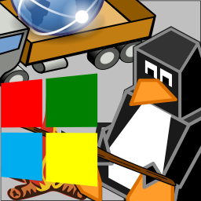
<!--
fi
 '_heading3' 'Soaring Distributions LLC - Manager'
if false; then true; # -->
<!-- # --><h3>Soaring Distributions LLC - Manager</h3>
<!--
fi
_t '
scriptedIllustrator_markup_uk4uPhB663kVcygT0q --><!-- # --><pre style="margin-top: 0px;margin-bottom: 0px;white-space: pre-wrap;">
Apr2022 - Present
https://soaringdistributions.github.io/site_distLLC/
Distribution of some (may be mostly if not entirely software, mostly if not 
entirely FLOSS) products.
<!-- # --></pre><!-- scriptedIllustrator_markup_uk4uPhB663kVcygT0q
'
 '_' '_heading3' 'Director - Self'
 '_' '_t' 'Aug2010 - Present
Self-taught and self-directed, particularly keen to develop open-source fabrication and communication technologies for public benefit.'
 '_page' ' '
if false; then true; # -->
<!-- # -->
 

<!--
fi
 '_heading2' 'Skills'
if false; then true; # -->
<!-- # --><h2>Skills</h2>
<!--
fi
_t '
scriptedIllustrator_markup_uk4uPhB663kVcygT0q --><!-- # --><pre style="margin-top: 0px;margin-bottom: 0px;white-space: pre-wrap;">Over the years, some specific skills have been put into use, by no means a 
complete list.

	Hardware design, electronic, mechanical, and optical.
Mechanical Design
Optical Design
Electrical Design
Analog
Simulation

	Design automation. Using gEDA, FreeCAD A2Plus.
FreeCAD
gEDA
GravitySketch
MakeVRPro

	Fabrication and fabrication tools. Including 3D printing, CNC 
milling, laser cutting/engraving, photolitography.
Fabrication
Manufacturing
Photolithography
CNC Milling
3D Printing
Laser Cutting

	Graphical design/editing. Using GIMP, Xournal, Inkscape, and others.
Graphics
GIMP
Xournal
Inkscape

	Programming/Scripting. Bash, C, C++, Arduino, Python, PHP, and 
similar.
Scripting
Programming
Bash
C
C++
Arduino
Python
MySQL

	Unix/Linux portability, Legacy/MSW compatibility.
Debian
Gentoo
Linux
UNIX
LiveUSB
Virtualization

	Cryptography.
Cryptography

	Signal processing, statistical confidence testing, psychometrics.
Filter Design
Infinite Impulse Response
Statistics
Correlation
Confidence Testing
Psychometrics

	Documentation.
Technical Writing
MediaWiki
HTML

	Strategic leadership.
Instruction
Project Management
Git
GitLab
Research
<!-- # --></pre><!-- scriptedIllustrator_markup_uk4uPhB663kVcygT0q
'
 '_page' ' '
if false; then true; # -->
<!-- # -->
 

<!--
fi
 '_heading2' 'Community'
if false; then true; # -->
<!-- # --><h2>Community</h2>
<!--
fi
_t '
scriptedIllustrator_markup_uk4uPhB663kVcygT0q --><!-- # --><pre style="margin-top: 0px;margin-bottom: 0px;white-space: pre-wrap;">
Have extensive experience leading community organizations, teaching freely 
available classes, and identifying issues in open-source code. 
Additionally, many other projects have been done collaboratively or in 
service of a larger community.
<!-- # --></pre><!-- scriptedIllustrator_markup_uk4uPhB663kVcygT0q
'
 '_heading3' 'Assistant Teacher to Dan Barlow for CNC Mill Class'
if false; then true; # -->
<!-- # --><h3>Assistant Teacher to Dan Barlow for CNC Mill Class</h3>
<!--
fi
_t '
scriptedIllustrator_markup_uk4uPhB663kVcygT0q --><!-- # --><pre style="margin-top: 0px;margin-bottom: 0px;white-space: pre-wrap;">
Mar2015
Class (at HacDC) began with Dan Barlow&#39;s outstanding theoretical 
introduction, which covered mounting hardware, cutting speeds, machine 
subsystems, and much more. Subsequently provided practical, hands-on 
individual instruction. Participants were independently able to attach 
appropriate mounting hardware, clamp workpieces, generate g-code using 
JSCut, and actually mill their designs.
<!-- # --></pre><!-- scriptedIllustrator_markup_uk4uPhB663kVcygT0q
'
 '_heading3' 'CAD Modeling Class'
if false; then true; # -->
<!-- # --><h3>CAD Modeling Class</h3>
<!--
fi
_t '
scriptedIllustrator_markup_uk4uPhB663kVcygT0q --><!-- # --><pre style="margin-top: 0px;margin-bottom: 0px;white-space: pre-wrap;">
May2013
Participants (at HacDC) were guided to create complex printable 3D models 
in under 20 minutes. Focus was on the fundamental geometric CAD workflow: 
sketching, constraining, extruding, face sketching, and assembling. After 
this tutorial, in-service part designs were demonstrated.
<!-- # --></pre><!-- scriptedIllustrator_markup_uk4uPhB663kVcygT0q
'
 '_heading3' 'KVIrc Weak Encryption (Bug Report)'
if false; then true; # -->
<!-- # --><h3>KVIrc Weak Encryption (Bug Report)</h3>
<!--
fi
_t '
scriptedIllustrator_markup_uk4uPhB663kVcygT0q --><!-- # --><pre style="margin-top: 0px;margin-bottom: 0px;white-space: pre-wrap;">
Jul2011
Tested and found KVIrc encryption to use only ECB mode, which outputs 
identical ciphertext for identical inputs and keys. Filed bug report, and 
contacted developer CtrlAltCa via IRC. Proper CBC mode encryption became 
available and documented for KVIrc as a result. Encrypting an image in ECB 
mode, as Wikipedia demonstrates, dramatically reveals this is an incorrect 
way to use otherwise secure ciphers.

http://en.wikipedia.org/wiki/Block_cipher_modes_of_operation
https://svn.kvirc.de/kvirc/ticket/1169
http://en.wikipedia.org/wiki/File:Tux_ecb.jpg
<!-- # --></pre><!-- scriptedIllustrator_markup_uk4uPhB663kVcygT0q
'
 '_heading3' 'Linux Kernel Tracer Bug (Software Testing)'
if false; then true; # -->
<!-- # --><h3>Linux Kernel Tracer Bug (Software Testing)</h3>
<!--
fi
_t '
scriptedIllustrator_markup_uk4uPhB663kVcygT0q --><!-- # --><pre style="margin-top: 0px;margin-bottom: 0px;white-space: pre-wrap;">
Apr2012
Reported and assisted diagnosis for a Linux kernel bug affecting kernel 
latency (ie. desktop interactivity). Bug fix was subsequently committed to 
mainline Linux kernel.
See commit db4c75cbebd7e5910cd3bcb6790272fcc3042857 at 
http://www.kernel.org/pub/linux/kernel/v3.x/ChangeLog-3.3.5.
<!-- # --></pre><!-- scriptedIllustrator_markup_uk4uPhB663kVcygT0q
'
 '_heading3' 'Web2Project (Feature and Bugfix)'
if false; then true; # -->
<!-- # --><h3>Web2Project (Feature and Bugfix)</h3>
<!--
fi
_t '
scriptedIllustrator_markup_uk4uPhB663kVcygT0q --><!-- # --><pre style="margin-top: 0px;margin-bottom: 0px;white-space: pre-wrap;">
Mar2015
Added URL-based autofill functionality.
	https://github.com/web2project/web2project/pull/284

Corrected Calendar URL feed link generator logic. Commit merged into 
mainline.
	https://github.com/web2project/web2project/pull/284
<!-- # --></pre><!-- scriptedIllustrator_markup_uk4uPhB663kVcygT0q
'
 '_heading3' 'DAViCal (Bugfix)'
if false; then true; # -->
<!-- # --><h3>DAViCal (Bugfix)</h3>
<!--
fi
_t '
scriptedIllustrator_markup_uk4uPhB663kVcygT0q --><!-- # --><pre style="margin-top: 0px;margin-bottom: 0px;white-space: pre-wrap;">
Mar2015
Minor bugfix regarding BIND request (external subscription) support. See 
dmfs.org for a description of this functionality.
	
https://github.com/mirage335/davical/commit/60895b6aef8cfea6a2b2f29653d33f98
c35e7bba
	http://dmfs.org/wiki/index.php?title=DAViCal
<!-- # --></pre><!-- scriptedIllustrator_markup_uk4uPhB663kVcygT0q
'
 '_page' ' '
if false; then true; # -->
<!-- # -->
 

<!--
fi
 '_heading2' 'Tools'
if false; then true; # -->
<!-- # --><h2>Tools</h2>
<!--
fi
_t '
scriptedIllustrator_markup_uk4uPhB663kVcygT0q --><!-- # --><pre style="margin-top: 0px;margin-bottom: 0px;white-space: pre-wrap;">
(notable)
<!-- # --></pre><!-- scriptedIllustrator_markup_uk4uPhB663kVcygT0q
'
 '_heading3' 'ubiquitous_bash'
if false; then true; # -->
<!-- # --><h3>ubiquitous_bash</h3>
<!--
fi
_t '
scriptedIllustrator_markup_uk4uPhB663kVcygT0q --><!-- # --><pre style="margin-top: 0px;margin-bottom: 0px;white-space: pre-wrap;">At ~1MB of human written shell code, as of 2021, &#39;ubiquitous_bash&#39; 
is expected to remain largest, most sophisticated, most robust, and most 
all purpose, shell script ever created.

Compressed header templates exist to provide hundreds of functions for 
small single-script projects. If you have a problem that needs a shell 
script, you need &#39;ubiquitous_bash&#39;.

Software containment and interoperability, multiplatform structured 
programming middleware. Compatible with UNIX/Linux and Cygwin/MSW.

Build environments for arduino firmware (libraries, custom crystal-free 
boards, real-time debugger services), PCB photolithography (custom patched 
pcb2gcode binary), 3D printer fabrication (speed, cooling), etc, were 
fragile. Relying on Gentoo or Arch Linux to keep these dependencies usable 
while upgrading and installing other software would end up in a broken, 
unmaintainable state.

Hence, Ubiquitous Bash happened. Software would see the same directories 
even if absolute locations changed (ie. &#39;abstractfs&#39;), have 
environment variables pointing to neighboring directories, dependencies 
would be installed automatically, tests would go far beyond usual CMake, 
and if necessary, filesystem parameters would automatically translate to 
run GUI programs through any virtualization backend (eg. ChRoot, QEMU, 
VirtualBox, Docker) which remained usable (always using the same raw disk 
image). Shared 3D space and multiple-input multiple-output pipes would be 
arranged as filesystem directories, automatically named pipes, triple 
buffers, etc, by the &#39;MetaEngine&#39; module of the script. Later, 
ad-hoc Inter-Process Communication (IPC) would emulate the &#39;shared pair 
of wires&#39; more typical of a hardware serial bus by both triple buffer 
and resetting pipes. All of this would also apply what few OS (both x64 and 
RasPi) customizations were still desired - copying these portable 
installations into bootable disk images and hooking developer functions 
into &#39;.bashrc &#39; through ChRoot.

At least three years of shell scripting, >20k SLOC, and field testing, 
&#39;ubiquitous_bash&#39; has acheived all objectives.

This document itself is self-modifying interleaved shell code from 
&#39;ubiquitous_bash&#39; and markup.

https://github.com/mirage335/ubiquitous_bash
<!-- # --></pre><!-- scriptedIllustrator_markup_uk4uPhB663kVcygT0q
'
 '_heading3' 'scriptedIllustrator'
if false; then true; # -->
<!-- # --><h3>scriptedIllustrator</h3>
<!--
fi
_t '
scriptedIllustrator_markup_uk4uPhB663kVcygT0q --><!-- # --><pre style="margin-top: 0px;margin-bottom: 0px;white-space: pre-wrap;">Documentation generation as self-modifying file of interleaved shell code 
from &#39;ubiquitous_bash&#39; and markup (using block comments of each 
language). Multiple simultaneous self-modifying output formats (HTML, 
MediaWiki, Markdown) and PDF conversion.

This document itself is created by &#39;scriptedIllustrator&#39;.

https://github.com/mirage335/scriptedIllustrator
<!-- # --></pre><!-- scriptedIllustrator_markup_uk4uPhB663kVcygT0q
'
 '_heading3' 'BOM_designer'
if false; then true; # -->
<!-- # --><h3>BOM_designer</h3>
<!--
fi
_t '
scriptedIllustrator_markup_uk4uPhB663kVcygT0q --><!-- # --><pre style="margin-top: 0px;margin-bottom: 0px;white-space: pre-wrap;">Hierarchical all-purpose Bill-of-Materials (aka. BOM) generator. 
Specifically intended to tally components from complex assemblies of other 
complex assemblies.

https://github.com/mirage335/BOM_designer
<!-- # --></pre><!-- scriptedIllustrator_markup_uk4uPhB663kVcygT0q
'
 '_heading3' 'gEDA_designer'
if false; then true; # -->
<!-- # --><h3>gEDA_designer</h3>
<!--
fi
_t '
scriptedIllustrator_markup_uk4uPhB663kVcygT0q --><!-- # --><pre style="margin-top: 0px;margin-bottom: 0px;white-space: pre-wrap;">Generates, manufacturing (ie. gerber, centroid), distributor (eg. Mouser 
CSV), CAD (eg. SVG, DXF), model (eg. PDF, PNG),  photomask (eg. PDF), 
files. Includes template and vector tests. May use similarly contained 
custom patched &#39;pcb2gcode&#39; and/or &#39;pcb&#39; as necessary for 
photomask, CNC drill/routing path, and autorouting compatibility.

https://github.com/mirage335/gEDA_designer
<!-- # --></pre><!-- scriptedIllustrator_markup_uk4uPhB663kVcygT0q
'
 '_heading3' 'arduinoUbiquitous'
if false; then true; # -->
<!-- # --><h3>arduinoUbiquitous</h3>
<!--
fi
_t '
scriptedIllustrator_markup_uk4uPhB663kVcygT0q --><!-- # --><pre style="margin-top: 0px;margin-bottom: 0px;white-space: pre-wrap;">Arduino build environments, projects, configuration, self-contained 
relative to &#39;ino&#39; file instead of user directories.

Project and library file absolute locations always appear at same location 
(eg. &#39;/dev/shm/...&#39;) set by an automatically generated 
&#39;project.afs&#39; file (ie. &#39;ubiquitous_bash&#39; 
&#39;abstractfs&#39;). Working ARM hardware debugging services included 
with randomized network port connection to &#39;gdb&#39;, &#39;ddd&#39;, 
etc. Robust serial port and hardware port communication interaction and 
upload. Extensible by imported shell script neighboring &#39;ino&#39; file 
(eg. to implement firmware-specific serial port identification). Certified 
well-tested versions noted in README file. Among other features.

https://github.com/mirage335/arduinoUbiquitous
<!-- # --></pre><!-- scriptedIllustrator_markup_uk4uPhB663kVcygT0q
'
 '_heading3' 'PatchRap'
if false; then true; # -->
<!-- # --><h3>PatchRap</h3>
<!--
fi
_t '
scriptedIllustrator_markup_uk4uPhB663kVcygT0q --><!-- # --><pre style="margin-top: 0px;margin-bottom: 0px;white-space: pre-wrap;">Modular and standardized machine wiring, power distribution. One wire from 
3D printer &#39;motherboard&#39; per limit switch cable, instead of three.

Instant &#39;PatchPanel&#39; combining a breadboards with a generic PCB. 
Adapts logic, sensors, actuators, and data networks to inexpensive, highly 
shielded long haul Ethernet/Telephone cable. Carefully provisioned for a 
vast diversity of applications, including vehicles, industrial automation, 
and datacenter monitoring. CNC and stepper motor driving use cases have 
been specifically documented. Innumerable configuration options are 
thoroughly supported. Printable color coded labels are available for 
maximum safety in high-power and high-reliability systems. Product of 
Soaring Industries LLC.

https://github.com/mirage335/PatchRap/blob/master/PatchRap.pdf
<!-- # --></pre><!-- scriptedIllustrator_markup_uk4uPhB663kVcygT0q
'
 '_heading3' 'LiveUSB/LiveCD'
if false; then true; # -->
<!-- # --><h3>LiveUSB/LiveCD</h3>
<!--
fi
_t '
scriptedIllustrator_markup_uk4uPhB663kVcygT0q --><!-- # --><pre style="margin-top: 0px;margin-bottom: 0px;white-space: pre-wrap;">
Built by &#39;ubiquitous_bash&#39;. Hibernation Snapshot, SaveState (VM 
features on any virtualization backend or physical computer hardware). 
Bootable disk images from same build also will be used as development 
computer (x64), end-user computer (x64), cloud services (x64) for 
thin-client, and embedded (RasPi) OS distribution.
<!-- # --></pre><!-- scriptedIllustrator_markup_uk4uPhB663kVcygT0q
'
 '_heading3' 'TazIntermediate'
if false; then true; # -->
<!-- # --><h3>TazIntermediate</h3>
<!--
fi
_t '
scriptedIllustrator_markup_uk4uPhB663kVcygT0q --><!-- # --><pre style="margin-top: 0px;margin-bottom: 0px;white-space: pre-wrap;">Field test of tool usability, from electromechanical design, to the point 
of cabling diagramming and assembly rehearsal in VR. Only the VR part not 
yet 100% FLOSS, otherwise portable to any Linux (eg. VM) machine.

https://github.com/mirage335/TazIntermediate
<!-- # --></pre><!-- scriptedIllustrator_markup_uk4uPhB663kVcygT0q
'
 '_heading3' 'flipKey'
if false; then true; # -->
<!-- # --><h3>flipKey</h3>
<!--
fi
_t '
scriptedIllustrator_markup_uk4uPhB663kVcygT0q --><!-- # --><pre style="margin-top: 0px;margin-bottom: 0px;white-space: pre-wrap;">Multiplatform crypto shredding framework around veracrypt and cryptsetup. 
Ensures fragments of supposedly deleted or shielded plaintext are 
unreadable after any erasure, scrambling, or unobservability of the large 
(usually gigabytes) key file.

Notable *archival storage* capability real-time quad-redundant 
Magneto-Optical 640M discs and archival backup to BD-R. Reliability of 
Magneto-Optical 640M discs remains uniquely outstandingly useful today - 
thoroughly designed to ensure that data written is deeply embedded. 
Magneto-Optical discs are readable through ~2mm dust particles or defects, 
are designed not to split from elastic sealant layer, and have very strong 
magnetic coercivity when cooled after writing.

https://github.com/mirage335/flipKey
<!-- # --></pre><!-- scriptedIllustrator_markup_uk4uPhB663kVcygT0q
'
 '_heading3' 'coreoracle'
if false; then true; # -->
<!-- # --><h3>coreoracle</h3>
<!--
fi
_t '
scriptedIllustrator_markup_uk4uPhB663kVcygT0q --><!-- # --><pre style="margin-top: 0px;margin-bottom: 0px;white-space: pre-wrap;">Pure ciphertext communications and secret-sharing volume decryption. May 
enable radio messaging statistically indistinguishable to distant listeners 
from noise, add a layer of quantum computing resistance to existing 
asymmetric protocols (eg. SSH, SSL), and add network services dependence to 
disk encryption. For developers, &#39;coreoracle&#39; is also an example of 
using &#39;metaEngine&#39; (an &#39;ubiquitous bash&#39; feature).

https://github.com/mirage335/coreoracle
<!-- # --></pre><!-- scriptedIllustrator_markup_uk4uPhB663kVcygT0q
'
 '_page' ' '
if false; then true; # -->
<!-- # -->
 

<!--
fi
 '_heading2' 'Projects'
if false; then true; # -->
<!-- # --><h2>Projects</h2>
<!--
fi
_t '
scriptedIllustrator_markup_uk4uPhB663kVcygT0q --><!-- # --><pre style="margin-top: 0px;margin-bottom: 0px;white-space: pre-wrap;">
Assortment of side projects. Some continue as substantially important 
resources, others as expended resources having fulfilled a useful purpose 
and exemplified principles for future work.
<!-- # --></pre><!-- scriptedIllustrator_markup_uk4uPhB663kVcygT0q
'
 '_picture' '../../../../zzLib_895-reference/facilities/workbench.jpg' '25%'
if false; then true; # -->
<!-- # -->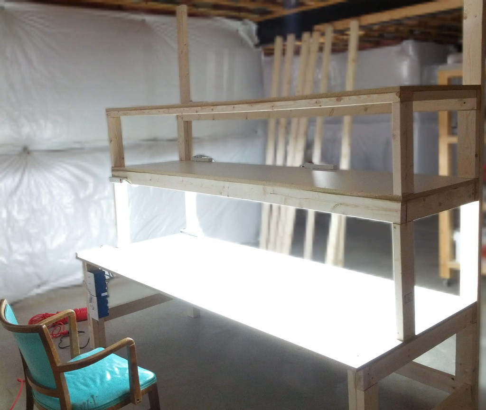
<!--
fi
 '_image' '../../../../zzLib_895-reference/facilities/facilities-vrWorkstation-more.jpg' '70%'
if false; then true; # -->
<!-- # -->
<!--
fi
 '_cells_begin'
if false; then true; # -->
<!-- # --><table width="0%" style="empty-cells: show; border-spacing: 0px; border: 1px solid black; margin-top: 0px; vertical-align: top;">
<!--
fi
 '_cells_row_begin'
if false; then true; # -->
<!-- # --><tr>
<!--
fi
 '_cells_speck_begin' '30%'
if false; then true; # -->
<!-- # --><td width="30%" colspan="1" style="border-spacing: 0px; border: 1px solid black; margin-top: 0px; vertical-align: top;">
<!--
fi
 '_picture' '../../../../zzLib_895-reference/demo/MightyTool.jpg' '98%'
if false; then true; # -->
<!-- # -->
<!--
fi
 '_cells_speck_end'
if false; then true; # -->
<!-- # --></td>
<!--
fi
 '_cells_speck_begin' '30%'
if false; then true; # -->
<!-- # --><td width="30%" colspan="1" style="border-spacing: 0px; border: 1px solid black; margin-top: 0px; vertical-align: top;">
<!--
fi
 '_picture' '../../../../zzLib_895-reference/demo/04-RigidTableAssembly.jpg' '98%'
if false; then true; # -->
<!-- # -->
<!--
fi
 '_cells_speck_end'
if false; then true; # -->
<!-- # --></td>
<!--
fi
 '_cells_speck_begin' '30%'
if false; then true; # -->
<!-- # --><td width="30%" colspan="1" style="border-spacing: 0px; border: 1px solid black; margin-top: 0px; vertical-align: top;">
<!--
fi
 '_picture' '../../../../zzLib_895-reference/demo/02-PrecisionEngraveTest.jpg' '98%'
if false; then true; # -->
<!-- # -->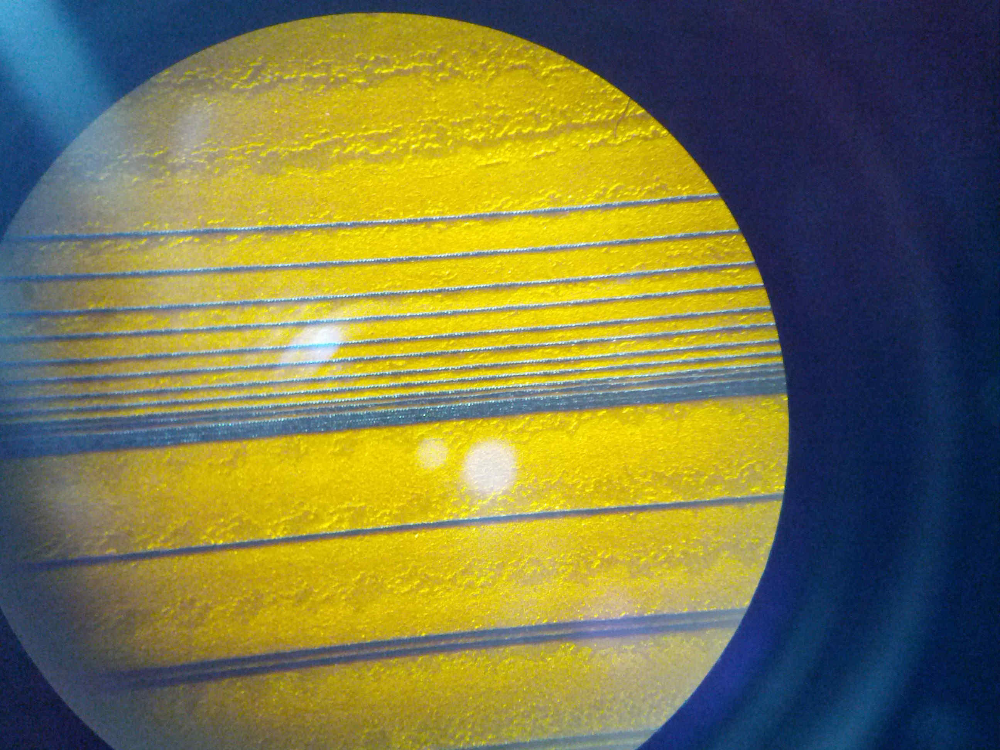
<!--
fi
 '_cells_speck_end'
if false; then true; # -->
<!-- # --></td>
<!--
fi
 '_cells_row_end'
if false; then true; # -->
<!-- # --></tr>
<!--
fi
 '_cells_end'
if false; then true; # -->
<!-- # --></table>
<!--
fi
 '_page' ' '
if false; then true; # -->
<!-- # -->
 

<!--
fi
 '_cells_begin'
if false; then true; # -->
<!-- # --><table width="0%" style="empty-cells: show; border-spacing: 0px; border: 1px solid black; margin-top: 0px; vertical-align: top;">
<!--
fi
 '_cells_row_begin'
if false; then true; # -->
<!-- # --><tr>
<!--
fi
 '_cells_speck_begin' '30%'
if false; then true; # -->
<!-- # --><td width="30%" colspan="1" style="border-spacing: 0px; border: 1px solid black; margin-top: 0px; vertical-align: top;">
<!--
fi
 '_picture' '../../../../zzLib_895-reference/demo/500px-PrusaMendelPresent.jpg' '98%'
if false; then true; # -->
<!-- # -->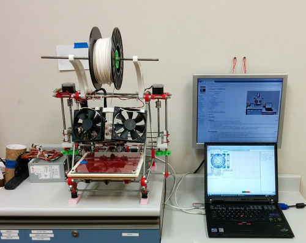
<!--
fi
 '_cells_speck_end'
if false; then true; # -->
<!-- # --></td>
<!--
fi
 '_cells_speck_begin' '30%'
if false; then true; # -->
<!-- # --><td width="30%" colspan="1" style="border-spacing: 0px; border: 1px solid black; margin-top: 0px; vertical-align: top;">
<!--
fi
 '_picture' '../../../../zzLib_895-reference/demo/TestCartStylish.jpg' '98%'
if false; then true; # -->
<!-- # -->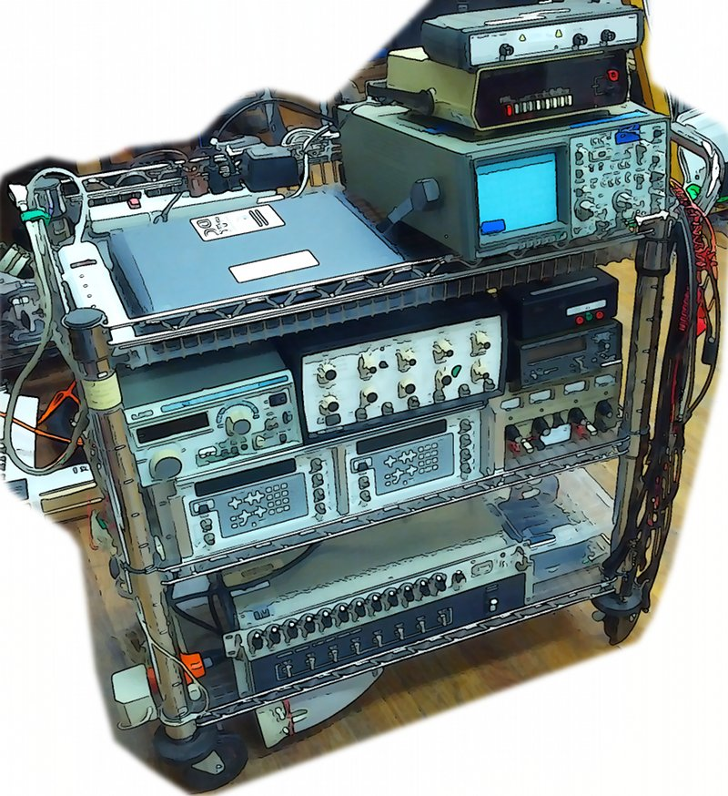
<!--
fi
 '_cells_speck_end'
if false; then true; # -->
<!-- # --></td>
<!--
fi
 '_cells_speck_begin' '30%'
if false; then true; # -->
<!-- # --><td width="30%" colspan="1" style="border-spacing: 0px; border: 1px solid black; margin-top: 0px; vertical-align: top;">
<!--
fi
 '_picture' '../../../../zzLib_895-reference/demo/OccupancySensor.jpg' '98%'
if false; then true; # -->
<!-- # -->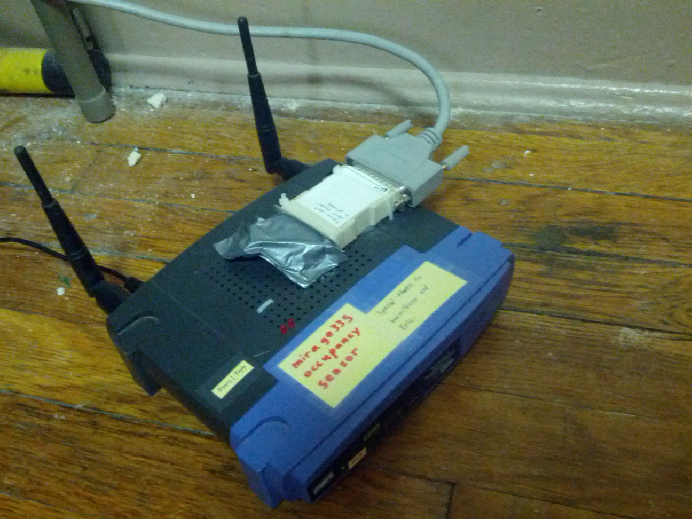
<!--
fi
 '_cells_speck_end'
if false; then true; # -->
<!-- # --></td>
<!--
fi
 '_cells_row_end'
if false; then true; # -->
<!-- # --></tr>
<!--
fi
 '_cells_row_begin'
if false; then true; # -->
<!-- # --><tr>
<!--
fi
 '_cells_speck_begin' '30%'
if false; then true; # -->
<!-- # --><td width="30%" colspan="1" style="border-spacing: 0px; border: 1px solid black; margin-top: 0px; vertical-align: top;">
<!--
fi
 '_picture' '../../../../zzLib_895-reference/PatchRap/PatchRap.jpg' '98%'
if false; then true; # -->
<!-- # -->
<!--
fi
 '_cells_speck_end'
if false; then true; # -->
<!-- # --></td>
<!--
fi
 '_cells_speck_begin' '30%'
if false; then true; # -->
<!-- # --><td width="30%" colspan="1" style="border-spacing: 0px; border: 1px solid black; margin-top: 0px; vertical-align: top;">
<!--
fi
 '_picture' '../../../../zzLib_895-reference/demo/02-heartbeat.jpg' '98%'
if false; then true; # -->
<!-- # -->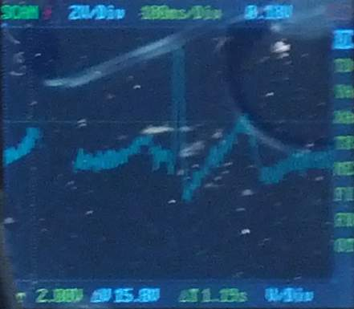
<!--
fi
 '_cells_speck_end'
if false; then true; # -->
<!-- # --></td>
<!--
fi
 '_cells_speck_begin' '30%'
if false; then true; # -->
<!-- # --><td width="30%" colspan="1" style="border-spacing: 0px; border: 1px solid black; margin-top: 0px; vertical-align: top;">
<!--
fi
 '_picture' '../../../../zzLib_895-reference/demo/08-AlphaWavesLowRes.jpg' '98%'
if false; then true; # -->
<!-- # -->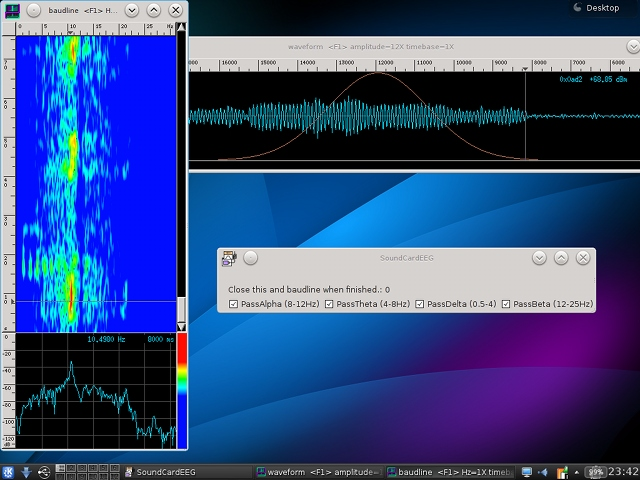
<!--
fi
 '_cells_speck_end'
if false; then true; # -->
<!-- # --></td>
<!--
fi
 '_cells_row_end'
if false; then true; # -->
<!-- # --></tr>
<!--
fi
 '_cells_row_begin'
if false; then true; # -->
<!-- # --><tr>
<!--
fi
 '_cells_speck_begin' '30%'
if false; then true; # -->
<!-- # --><td width="30%" colspan="1" style="border-spacing: 0px; border: 1px solid black; margin-top: 0px; vertical-align: top;">
<!--
fi
 '_picture' '../../../../zzLib_895-reference/demo/toroidFormer.png' '98%'
if false; then true; # -->
<!-- # -->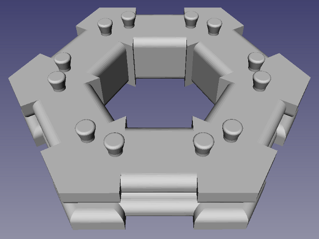
<!--
fi
 '_cells_speck_end'
if false; then true; # -->
<!-- # --></td>
<!--
fi
 '_cells_speck_begin' '30%'
if false; then true; # -->
<!-- # --><td width="30%" colspan="1" style="border-spacing: 0px; border: 1px solid black; margin-top: 0px; vertical-align: top;">
<!--
fi
 '_picture' '../../../../zzLib_895-reference/demo/Antenna.jpg' '98%'
if false; then true; # -->
<!-- # -->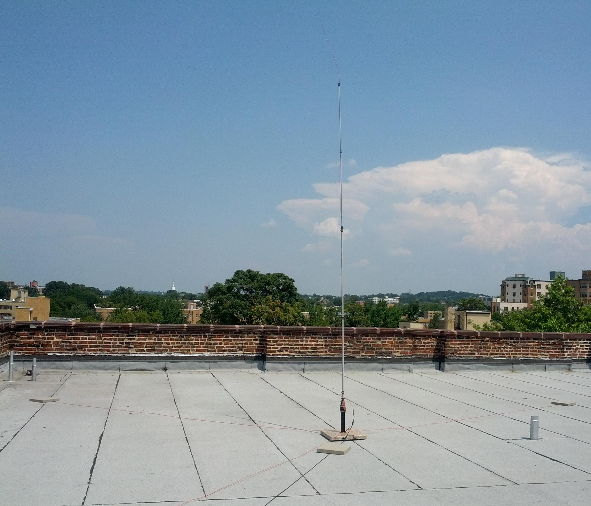
<!--
fi
 '_cells_speck_end'
if false; then true; # -->
<!-- # --></td>
<!--
fi
 '_cells_speck_begin' '30%'
if false; then true; # -->
<!-- # --><td width="30%" colspan="1" style="border-spacing: 0px; border: 1px solid black; margin-top: 0px; vertical-align: top;">
<!--
fi
 '_picture' '../../../../zzLib_895-reference/demo/AllBandTest.png' '98%'
if false; then true; # -->
<!-- # -->
<!--
fi
 '_cells_speck_end'
if false; then true; # -->
<!-- # --></td>
<!--
fi
 '_cells_row_end'
if false; then true; # -->
<!-- # --></tr>
<!--
fi
 '_cells_row_begin'
if false; then true; # -->
<!-- # --><tr>
<!--
fi
 '_cells_speck_begin' '30%'
if false; then true; # -->
<!-- # --><td width="30%" colspan="1" style="border-spacing: 0px; border: 1px solid black; margin-top: 0px; vertical-align: top;">
<!--
fi
 '_picture' '../../../../zzLib_895-reference/demo/commonControlScheme.png' '98%'
if false; then true; # -->
<!-- # -->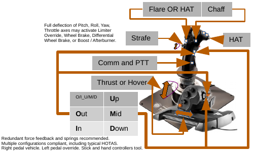
<!--
fi
 '_cells_speck_end'
if false; then true; # -->
<!-- # --></td>
<!--
fi
 '_cells_speck_begin' '30%'
if false; then true; # -->
<!-- # --><td width="30%" colspan="1" style="border-spacing: 0px; border: 1px solid black; margin-top: 0px; vertical-align: top;">
<!--
fi
 '_picture' '../../../../zzLib_895-reference/demo/referenceImplementations.png' '98%'
if false; then true; # -->
<!-- # -->
<!--
fi
 '_cells_speck_end'
if false; then true; # -->
<!-- # --></td>
<!--
fi
 '_cells_speck_begin' '30%'
if false; then true; # -->
<!-- # --><td width="30%" colspan="1" style="border-spacing: 0px; border: 1px solid black; margin-top: 0px; vertical-align: top;">
<!--
fi
 '_picture' '../../../../zzLib_895-reference/demo/PanelBoard.png' '98%'
if false; then true; # -->
<!-- # -->
<!--
fi
 '_cells_speck_end'
if false; then true; # -->
<!-- # --></td>
<!--
fi
 '_cells_row_end'
if false; then true; # -->
<!-- # --></tr>
<!--
fi
 '_cells_end'
if false; then true; # -->
<!-- # --></table>
<!--
fi
 '_page' ' '
if false; then true; # -->
<!-- # -->
 

<!--
fi
 '_cells_begin'
if false; then true; # -->
<!-- # --><table width="0%" style="empty-cells: show; border-spacing: 0px; border: 1px solid black; margin-top: 0px; vertical-align: top;">
<!--
fi
 '_cells_row_begin'
if false; then true; # -->
<!-- # --><tr>
<!--
fi
 '_cells_speck_begin' '30%'
if false; then true; # -->
<!-- # --><td width="30%" colspan="1" style="border-spacing: 0px; border: 1px solid black; margin-top: 0px; vertical-align: top;">
<!--
fi
 '_picture' '../../../../zzLib_895-reference/demo/zipTiePanel-box.jpg' '98%'
if false; then true; # -->
<!-- # -->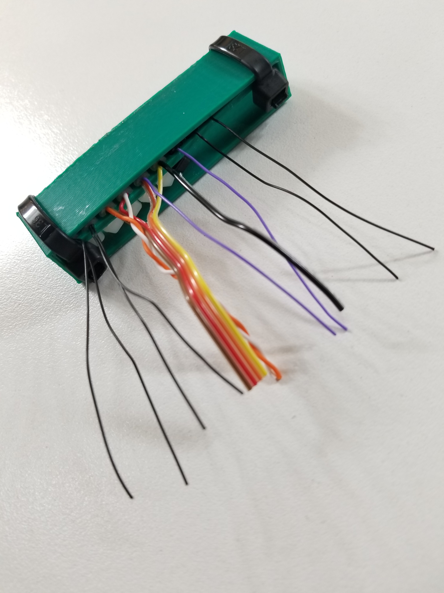
<!--
fi
 '_cells_speck_end'
if false; then true; # -->
<!-- # --></td>
<!--
fi
 '_cells_speck_begin' '30%'
if false; then true; # -->
<!-- # --><td width="30%" colspan="1" style="border-spacing: 0px; border: 1px solid black; margin-top: 0px; vertical-align: top;">
<!--
fi
 '_picture' '../../../../zzLib_895-reference/demo/zipTiePanel-splices.jpg' '98%'
if false; then true; # -->
<!-- # -->
<!--
fi
 '_cells_speck_end'
if false; then true; # -->
<!-- # --></td>
<!--
fi
 '_cells_speck_begin' '30%'
if false; then true; # -->
<!-- # --><td width="30%" colspan="1" style="border-spacing: 0px; border: 1px solid black; margin-top: 0px; vertical-align: top;">
<!--
fi
 '_picture' '../../../../zzLib_895-reference/demo/Render-Cabling-Front.jpg' '98%'
if false; then true; # -->
<!-- # -->
<!--
fi
 '_cells_speck_end'
if false; then true; # -->
<!-- # --></td>
<!--
fi
 '_cells_row_end'
if false; then true; # -->
<!-- # --></tr>
<!--
fi
 '_cells_row_begin'
if false; then true; # -->
<!-- # --><tr>
<!--
fi
 '_cells_speck_begin' '30%'
if false; then true; # -->
<!-- # --><td width="30%" colspan="1" style="border-spacing: 0px; border: 1px solid black; margin-top: 0px; vertical-align: top;">
<!--
fi
 '_picture' '../../../../zzLib_895-reference/demo/Blocks.png' '98%'
if false; then true; # -->
<!-- # -->
<!--
fi
 '_cells_speck_end'
if false; then true; # -->
<!-- # --></td>
<!--
fi
 '_cells_speck_begin' '30%'
if false; then true; # -->
<!-- # --><td width="30%" colspan="1" style="border-spacing: 0px; border: 1px solid black; margin-top: 0px; vertical-align: top;">
<!--
fi
 '_picture' '../../../../zzLib_895-reference/demo/Code.png' '98%'
if false; then true; # -->
<!-- # -->
<!--
fi
 '_cells_speck_end'
if false; then true; # -->
<!-- # --></td>
<!--
fi
 '_cells_speck_begin' '30%'
if false; then true; # -->
<!-- # --><td width="30%" colspan="1" style="border-spacing: 0px; border: 1px solid black; margin-top: 0px; vertical-align: top;">
<!--
fi
 '_picture' '../../../../zzLib_895-reference/demo/Render-Cabling-Back.jpg' '98%'
if false; then true; # -->
<!-- # -->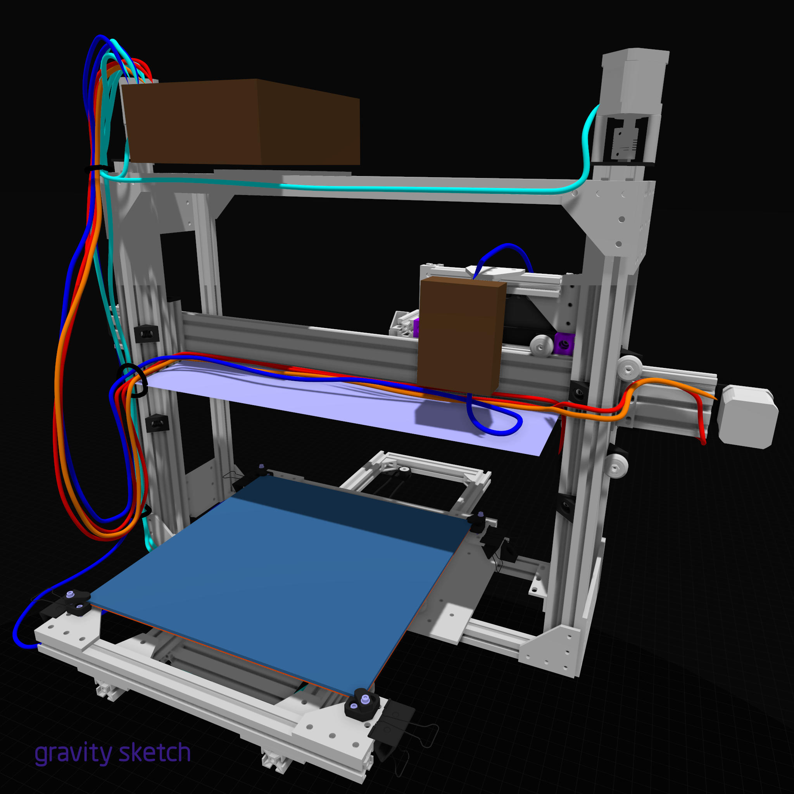
<!--
fi
 '_cells_speck_end'
if false; then true; # -->
<!-- # --></td>
<!--
fi
 '_cells_row_end'
if false; then true; # -->
<!-- # --></tr>
<!--
fi
 '_cells_end'
if false; then true; # -->
<!-- # --></table>
<!--
fi
 '_' '_cells_begin'
 '_' '_cells_row_begin'
 '_' '_cells_speck_begin' '75%'
 '_' '_picture' '../../../../zzLib_895-reference/demo/flightSim.jpg' '98%'
 '_' '_cells_speck_end'
 '_' '_cells_speck_begin' '20%'
 '_' '_picture' '../../../../zzLib_895-reference/emblems/businessCard_mirage335_pcb.png' '98%'
 '_' '_cells_speck_end'
 '_' '_cells_row_end'
 '_' '_cells_end'
 '_image' '../../../../zzLib_895-reference/demo/flightSim.jpg' '95%'
if false; then true; # -->
<!-- # -->
<!--
fi
 '_heading3' 'universalTechnologySpecificationTextbook'
if false; then true; # -->
<!-- # --><h3>universalTechnologySpecificationTextbook</h3>
<!--
fi
_t '
scriptedIllustrator_markup_uk4uPhB663kVcygT0q --><!-- # --><pre style="margin-top: 0px;margin-bottom: 0px;white-space: pre-wrap;">Feb2022-Present (part of &#39;mirage335_documents&#39;)

Self-Driving AI builds habitat throughout uninhabited galaxies and most of 
the Milky Way. Virtual Reality efficiently creates unlimited space for as 
many people as possible. Many people continue living on planetary surfaces.

Details of how to build all of the technologies to make this possible are 
described here. Also, some discussion of what should be done and why. 
Something of a &#39;how-to&#39; guide.

Notable headings.
*) problemSolversGuide
*) cognitionSplicer
*) neuralBits
*) mechDive
*) CARDinal
*) lithoDive
*) positionTrackers
*) sleeveDive
*) cryogenicComputer
*) flightDeck
*) modularAI

git clone --recursive git@github.com:mirage335/mirage335_documents.git

https://raw.githubusercontent.com/mirage335/mirage335_documents/main/mirage3
35_documents.pdf
<!-- # --></pre><!-- scriptedIllustrator_markup_uk4uPhB663kVcygT0q
'
_t '
scriptedIllustrator_markup_uk4uPhB663kVcygT0q --><!-- # --><pre style="margin-top: 0px;margin-bottom: 0px;white-space: pre-wrap;">

<!-- # --></pre><!-- scriptedIllustrator_markup_uk4uPhB663kVcygT0q
'
 '_cells_begin' '92%'
if false; then true; # -->
<!-- # --><table width="92%" style="empty-cells: show; border-spacing: 0px; border: 1px solid black; margin-top: 0px; vertical-align: top;">
<!--
fi
 '_cells_row_begin'
if false; then true; # -->
<!-- # --><tr>
<!--
fi
 '_cells_speck_begin' '58%'
if false; then true; # -->
<!-- # --><td width="58%" colspan="1" style="border-spacing: 0px; border: 1px solid black; margin-top: 0px; vertical-align: top;">
<!--
fi
 '_picture' '../../../../zzLib_895-reference/from_uTST/cognitionSplicer-topographicMapping.png' '98%'
if false; then true; # -->
<!-- # -->
<!--
fi
 '_cells_speck_end'
if false; then true; # -->
<!-- # --></td>
<!--
fi
 '_cells_speck_begin' '32%'
if false; then true; # -->
<!-- # --><td width="32%" colspan="1" style="border-spacing: 0px; border: 1px solid black; margin-top: 0px; vertical-align: top;">
<!--
fi
 '_cells_begin'
if false; then true; # -->
<!-- # --><table width="0%" style="empty-cells: show; border-spacing: 0px; border: 1px solid black; margin-top: 0px; vertical-align: top;">
<!--
fi
 '_cells_row_begin'
if false; then true; # -->
<!-- # --><tr>
<!--
fi
 '_cells_speck_begin' '98%'
if false; then true; # -->
<!-- # --><td width="98%" colspan="1" style="border-spacing: 0px; border: 1px solid black; margin-top: 0px; vertical-align: top;">
<!--
fi
 '_picture' '../../../../zzLib_895-reference/from_uTST/problemSolversGuide-amplifier-commonEmitter.png' '98%'
if false; then true; # -->
<!-- # -->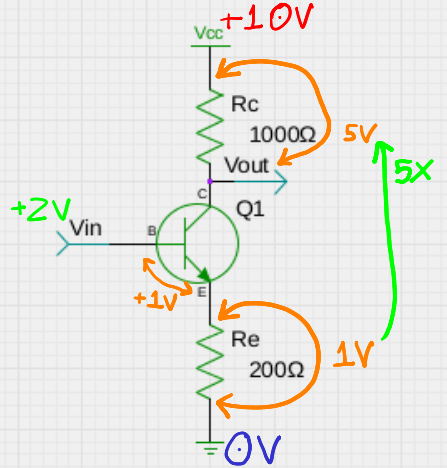
<!--
fi
 '_cells_speck_end'
if false; then true; # -->
<!-- # --></td>
<!--
fi
 '_cells_row_end'
if false; then true; # -->
<!-- # --></tr>
<!--
fi
 '_cells_row_begin'
if false; then true; # -->
<!-- # --><tr>
<!--
fi
 '_cells_speck_begin' '98%'
if false; then true; # -->
<!-- # --><td width="98%" colspan="1" style="border-spacing: 0px; border: 1px solid black; margin-top: 0px; vertical-align: top;">
<!--
fi
 '_picture' '../../../../zzLib_895-reference/from_uTST/neuralBits-zEXCERPTED-diagram-picture.png' '98%'
if false; then true; # -->
<!-- # -->
<!--
fi
 '_cells_speck_end'
if false; then true; # -->
<!-- # --></td>
<!--
fi
 '_cells_row_end'
if false; then true; # -->
<!-- # --></tr>
<!--
fi
 '_cells_row_begin'
if false; then true; # -->
<!-- # --><tr>
<!--
fi
 '_cells_speck_begin' '98%'
if false; then true; # -->
<!-- # --><td width="98%" colspan="1" style="border-spacing: 0px; border: 1px solid black; margin-top: 0px; vertical-align: top;">
<!--
fi
 '_picture' '../../../../zzLib_895-reference/from_uTST/lithoDive-flatTool.png' '98%'
if false; then true; # -->
<!-- # -->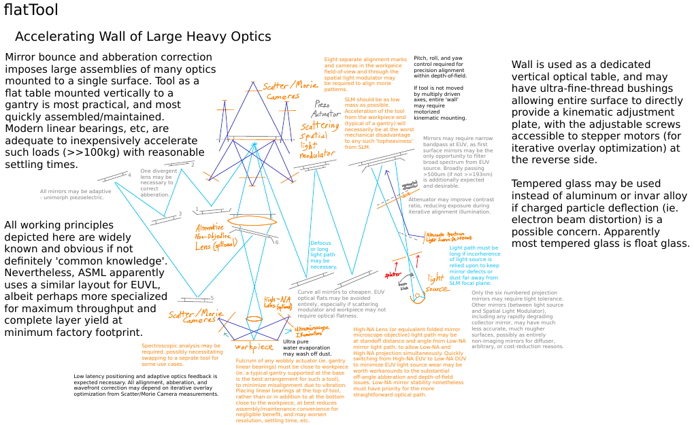
<!--
fi
 '_cells_speck_end'
if false; then true; # -->
<!-- # --></td>
<!--
fi
 '_cells_row_end'
if false; then true; # -->
<!-- # --></tr>
<!--
fi
 '_cells_end'
if false; then true; # -->
<!-- # --></table>
<!--
fi
 '_cells_speck_end'
if false; then true; # -->
<!-- # --></td>
<!--
fi
 '_cells_row_end'
if false; then true; # -->
<!-- # --></tr>
<!--
fi
 '_cells_end'
if false; then true; # -->
<!-- # --></table>
<!--
fi
 '_page' ' '
if false; then true; # -->
<!-- # -->
 

<!--
fi
 '_heading3' 'Industrial Computerized Numerical Control (CNC) Platforms'
if false; then true; # -->
<!-- # --><h3>Industrial Computerized Numerical Control (CNC) Platforms</h3>
<!--
fi
_t '
scriptedIllustrator_markup_uk4uPhB663kVcygT0q --><!-- # --><pre style="margin-top: 0px;margin-bottom: 0px;white-space: pre-wrap;">
Aug2015-Present
Designing, building, and operating a growing base of industrial 
Computerized Numerical Control (CNC) platforms.

TazMega and TazStiff are fully self-designed, built, and operated. TazUp 
simplifies the upgrade process for existing stock LulzBot Taz machines to a 
three-step process emphasizing the benefits of metal plates instead of 
plastic brackets.

Accessories applicable to virtually all CNC platforms have become available 
to the public through these projects. Most notably, RigidTable provides the 
strong base to resist stress that would deform less robust machines, and 
heavy tools simultaneously combining 3D printing extruders, milling 
spindles, and various lasers have been demonstrated.

TazStiff was demonstrated at the US Capitol during Public Knowledge 3D/DC 
2016. TazMega and TazStiff were both demonstrated at USA Science & 
Engineering Festival (USASEF) 2016.

https://github.com/mirage335/Taz_Mega
https://github.com/mirage335/TazMega-SDCard
https://github.com/mirage335/TazMega-Softload
https://github.com/mirage335/TazStiff
https://github.com/mirage335/TazStiff/blob/master/TazUpHowTo.pdf
https://github.com/mirage335/TazIntermediate

https://github.com/mirage335/RigidTable
https://github.com/mirage335/TazStiff/blob/master/Table/Table.fcstd

https://www.facebook.com/publicknowledge/photos/a.10154183159401600.10737418
33.81651801599/10154183164601600
https://youtu.be/0Vlh9-MIHSo?t=38
<!-- # --></pre><!-- scriptedIllustrator_markup_uk4uPhB663kVcygT0q
'
 '_heading3' 'PrusaMendel'
if false; then true; # -->
<!-- # --><h3>PrusaMendel</h3>
<!--
fi
_t '
scriptedIllustrator_markup_uk4uPhB663kVcygT0q --><!-- # --><pre style="margin-top: 0px;margin-bottom: 0px;white-space: pre-wrap;">
May2013 - Mar2015
Collaboratively, have upgraded rigidity, lifespan, and usability for 
HacDC&#39;s Prusa Mendel 3D Printer. Responsible for more than half the 
printer&#39;s parts, through upgrades over a three year period, as well as 
for the printer remaining operational. Maintenance has included 
documentation, extruder fabrication, CNC milling stronger parts, spool 
holder fabrication, complete print-surface re-engineering, and eliminating 
manual priming from the printing process. Special thanks to Julia Longtin 
for timely parts and debugging assistance, and mentorship.

Since then the platform has manufactured the models crucial to Julia 
Longtin&#39;s CCC31 presentation on lost-PLA aluminum casting by consumer 
microwave oven heating. Consequently, the overall effort has been directly 
responsible for HacDC freely acquiring an outstanding LulzBot Mini. 
High-maintenance requirements of the PrusaMendel continued to provide a 
highly educational robotics &#39;school&#39; as well after that.

Personally, the PrusaMendel was a very important introduction to 3D 
printing and much needed experience solving mechanical issues and 
quantifying the need for machine rigidity.

https://www.youtube.com/watch?v=JsSndSXFl8M
https://wiki.hacdc.org/index.php/Category:PrusaMendel

http://www.hacdc.org/2015/03/10/hacdc-wins-lulzbot-mini-3d-printer-hackerspa
ce-giveaway/
<!-- # --></pre><!-- scriptedIllustrator_markup_uk4uPhB663kVcygT0q
'
 '_heading3' 'Biosignal Amplifier'
if false; then true; # -->
<!-- # --><h3>Biosignal Amplifier</h3>
<!--
fi
_t '
scriptedIllustrator_markup_uk4uPhB663kVcygT0q --><!-- # --><pre style="margin-top: 0px;margin-bottom: 0px;white-space: pre-wrap;">
Nov2012-Present
<!-- # --></pre><!-- scriptedIllustrator_markup_uk4uPhB663kVcygT0q
'
_t '
scriptedIllustrator_markup_uk4uPhB663kVcygT0q --><!-- # --><pre style="margin-top: 0px;margin-bottom: 0px;white-space: pre-wrap;">Animals (including humans) produce weak electrical signals, as hearts beat, 
muscles move, and neurons fire. Using all the best techniques and 
components, a uniquely low-noise high-dynamic-range biosignal amplifier has 
been achieved to pull out even the weakest biosignals for research 
purposes. Mirage335BiosignalAmp employs new research on low-noise amplifier 
chips and extensive measures to reject external noise such as feedback AC 
coupling, driven shields, and active probes. An ArduinoDAQ, 24bit ADC, is 
also onboard, paired with high-order digital IIR filters efficient enough 
to run in real-time on AVR (ie. Arduino) microcontrollers before handing 
off the raw audio format data through USB connection.

Complete schematics, PCBs, BOMs, documentation, repositories, and investor 
list, have been published.
Special thanks to Shawn Nock for creating oshpark conversion script, having 
inspired &#39;GEDAProduction&#39; and later &#39;gEDA_designer&#39;, 
generating a variety of PCB related fabrication assets (eg. CAD models, 
gerber files, BOM, PDF photomasks). In all, advice, funding, assembly, and 
testing help came from &#39;Shawn Nock&#39;, &#39;Sharad Satsangi&#39;, 
&#39;Stuart Washington&#39;, &#39;The Real Plato&#39;, &#39;Logan 
Scheel&#39;.

https://wiki.hacdc.org/index.php/Category:BiosignalAmplifier
<!-- # --></pre><!-- scriptedIllustrator_markup_uk4uPhB663kVcygT0q
'
 '_heading3' 'TestCart'
if false; then true; # -->
<!-- # --><h3>TestCart</h3>
<!--
fi
_t '
scriptedIllustrator_markup_uk4uPhB663kVcygT0q --><!-- # --><pre style="margin-top: 0px;margin-bottom: 0px;white-space: pre-wrap;">
Jan2013-Dec2016
Built up HacDC&#39;s test equipment cart to handle almost any electronics 
design problem, through self-built hardware, salvaged components, 
recommended purchases, and efficient cart layout. Among other things, 
capabilities were broad enough to construct superheterodyne HF receivers in 
a few minutes just by connecting equipment with BNC cables. After serving 
many useful purposes for a long time, unfortunately was disassembled due to 
temporary disuse and pressing need for floor space. Until then, this was 
most likely the most complete publicly available electronics test facility 
at or near the US East Coast.

https://wiki.hacdc.org/index.php/Category:TestCart
<!-- # --></pre><!-- scriptedIllustrator_markup_uk4uPhB663kVcygT0q
'
 '_heading3' '30MHz_LowPass'
if false; then true; # -->
<!-- # --><h3>30MHz_LowPass</h3>
<!--
fi
_t '
scriptedIllustrator_markup_uk4uPhB663kVcygT0q --><!-- # --><pre style="margin-top: 0px;margin-bottom: 0px;white-space: pre-wrap;">
Oct2013-Present
Air-core toroid, extremely high performance DC-HF preselection filter for 
extremely high dynamic range upconverting superheterodyne radios. 
Functional, tested, and using robust 3D printed electrical components of 
own manufacture.

https://github.com/mirage335/30MhzLowPass
<!-- # --></pre><!-- scriptedIllustrator_markup_uk4uPhB663kVcygT0q
'
 '_heading3' '3D Printed Air-Core Toroid Inductors'
if false; then true; # -->
<!-- # --><h3>3D Printed Air-Core Toroid Inductors</h3>
<!--
fi
_t '
scriptedIllustrator_markup_uk4uPhB663kVcygT0q --><!-- # --><pre style="margin-top: 0px;margin-bottom: 0px;white-space: pre-wrap;">
Oct2013-Present
Air-core toroid inductors improve electromagnetic interference (EMI), 
unwanted magnetic coupling, and high-frequency performance. Counter-winding 
channel eliminates the &#39;one-turn-loop&#39; effect, confining the 
magnetic field entirely within the toroid and attenuating coupling between 
stacked toroids to better than -20dB (100x). Whereas air-core stacked 
planar or solenoid conductors would have nearly 0dB (1x) coupling. Now, 
plastic formers printed for air-core toroids offer these benefits cheaply 
on demand.

https://www.thingiverse.com/thing:870592
<!-- # --></pre><!-- scriptedIllustrator_markup_uk4uPhB663kVcygT0q
'
 '_heading3' 'HacDC HF Antenna'
if false; then true; # -->
<!-- # --><h3>HacDC HF Antenna</h3>
<!--
fi
_t '
scriptedIllustrator_markup_uk4uPhB663kVcygT0q --><!-- # --><pre style="margin-top: 0px;margin-bottom: 0px;white-space: pre-wrap;">
Aug2012-Apr2013
As a HacDC project, provided worldwide HF (shortwave) amateur radio 
communication, having served as the club&#39;s primary antenna for at least 
three years. This replaced an antenna remote amateur radio operator 
receivers confirmed as inoperable for transmission. Testing a variety of 
antennas in a rural open field demonstrated a 20m quarter-wave (5m height) 
vertical monopole antenna was most suitable. With an SGC-237 autotuner, 
all-band coverage from 1.8MHz to 29.7MHz has been available, meeting the 
requirements for automatic link establishment. Special thanks to Martin 
Rothfield for testing and arranging roof access.

http://en.wikipedia.org/wiki/Automatic_link_establishment
https://www.hacdc.org/2012/08/17/new-amateur-radio-antenna/
<!-- # --></pre><!-- scriptedIllustrator_markup_uk4uPhB663kVcygT0q
'
 '_heading3' 'AudioToResistance'
if false; then true; # -->
<!-- # --><h3>AudioToResistance</h3>
<!--
fi
_t '
scriptedIllustrator_markup_uk4uPhB663kVcygT0q --><!-- # --><pre style="margin-top: 0px;margin-bottom: 0px;white-space: pre-wrap;">
May2013-Jun2013
Collaboratively worked with Project Byzantium development team at HacDC to 
trigger Push-To-Talk radio inputs using only energy received from audio 
line-level signals. Enables high-speed data transmission across VHF/UHF 
amateur radio technology, requiring only low-cost &#39;handie talkies&#39; 
as transceivers. Assistance provided included several schematic designs and 
CNC milled PCBs in one night.

http://project-byzantium.org/
https://github.com/HacDC/AudioToResistance/blob/master/Basic.sch.png
<!-- # --></pre><!-- scriptedIllustrator_markup_uk4uPhB663kVcygT0q
'
 '_heading3' 'Web Services'
if false; then true; # -->
<!-- # --><h3>Web Services</h3>
<!--
fi
_t '
scriptedIllustrator_markup_uk4uPhB663kVcygT0q --><!-- # --><pre style="margin-top: 0px;margin-bottom: 0px;white-space: pre-wrap;">
Oct2014-Apr2016
Hosted at HacDC, using servers Shimmer, Starlight, and Nebula. Personally 
setup and shared with the community. After serving useful purposes, 
especially VPS hosting for HacDC members, unfortunately defunct due to 
eroding physical hosting space and ISP changes. Reuse, donation to another 
hackerspace, or salvage, are all possible, as the components remain 
relevant, valuable, and especially reliable (notably having been 
manufacturered near the end of server exemption from RoHS).

http://hacdc.org/
https://wiki.hacdc.org/index.php/Shimmer
https://wiki.hacdc.org/index.php/Starlight
https://wiki.hacdc.org/index.php/Nebula
<!-- # --></pre><!-- scriptedIllustrator_markup_uk4uPhB663kVcygT0q
'
 '_heading3' 'Flight Sim
Aug2018-Present'
if false; then true; # -->
<!-- # --><h3>Flight Sim
<!-- # -->Aug2018-Present</h3>
<!--
fi
_t '
scriptedIllustrator_markup_uk4uPhB663kVcygT0q --><!-- # --><pre style="margin-top: 0px;margin-bottom: 0px;white-space: pre-wrap;">
Proficient (at least when not out of practice) in DCS World with FA18C and 
other simulated aircraft including F16C, to the point of complete startup 
procedures, avionics use, night carrier landings, formation flying, 
approach plates, etc. Partly used to perfect the 
&#39;commonControlScheme&#39; single-stick compatible HOTAS specification, 
and alternative voice commands, carefully provisioned for mapping of all 
controls to buttons and axes for a much wider variety of tools and vehicles 
.
<!-- # --></pre><!-- scriptedIllustrator_markup_uk4uPhB663kVcygT0q
'
 '_picture' '../../../../zzLib_895-reference/emblems/businessCard_mirage335_pcb.png' '30%'
if false; then true; # -->
<!-- # -->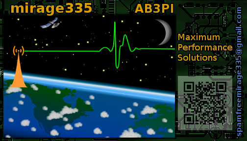
<!--
fi
 '_heading3' 'BusinessCard'
if false; then true; # -->
<!-- # --><h3>BusinessCard</h3>
<!--
fi
_t '
scriptedIllustrator_markup_uk4uPhB663kVcygT0q --><!-- # --><pre style="margin-top: 0px;margin-bottom: 0px;white-space: pre-wrap;">
Nov2012-Present
Custom graphics. Only the satellite, antenna, clouds, stars, are clipart 
from OpenClipArt or Inkscape. All other work is an original design. Actual 
cards are color laser printed as seamless 12 card panels, then depanelized 
by HacDC&#39;s 40W CO2 laser cutter (and later Makersmiths&#39;s CO2 laser 
cutter).
<!-- # --></pre><!-- scriptedIllustrator_markup_uk4uPhB663kVcygT0q
'
 '_page' ' '
if false; then true; # -->
<!-- # -->
 

<!--
fi
 '_heading2' 'Formal Qualifications'
if false; then true; # -->
<!-- # --><h2>Formal Qualifications</h2>
<!--
fi
_t '
scriptedIllustrator_markup_uk4uPhB663kVcygT0q --><!-- # --><pre style="margin-top: 0px;margin-bottom: 0px;white-space: pre-wrap;">Self Taught, Aggressively

Amateur Radio Licensed, Extra Class, earned in one sitting. Callsign AB3PI.
	
https://wireless2.fcc.gov/UlsApp/UlsSearch/license.jsp?licKey=3350807
	Issued Feb 2012
	No Expiration Date

CompTIA Linux+ Certified
	
https://www.credly.com/badges/0169e322-dc3b-4972-92de-edb64c4136d9/public_ur
l
	http://en.wikipedia.org/wiki/CompTIA#Linux.2B
	Issued Sep 2010
	No Expiration Date

Hurricane Electric IPv6 Certification
	
https://ipv6.he.net/certification/create_badge.php?pass_name=m335foundation&
badge=3
	Name: mirage335foundation
	Level: Sage
	Current Score: 1005
	Issued Feb 2017
	No Expiration Date

Black Belt, First Degree
<!-- # --></pre><!-- scriptedIllustrator_markup_uk4uPhB663kVcygT0q
'
_t '
scriptedIllustrator_markup_uk4uPhB663kVcygT0q --><!-- # --><pre style="margin-top: 0px;margin-bottom: 0px;white-space: pre-wrap;">

<!-- # --></pre><!-- scriptedIllustrator_markup_uk4uPhB663kVcygT0q
'
_t '
scriptedIllustrator_markup_uk4uPhB663kVcygT0q --><!-- # --><pre style="margin-top: 0px;margin-bottom: 0px;white-space: pre-wrap;">
UMUC
	GPA 4.0, Summa Cum Laude
	Bachelor&#39;s of Science (Psychology) Degree
	Computer Science Minor
<!-- # --></pre><!-- scriptedIllustrator_markup_uk4uPhB663kVcygT0q
'
 '_heading2' 'POLICY'
if false; then true; # -->
<!-- # --><h2>POLICY</h2>
<!--
fi
 '_heading3' 'Copyleft'
if false; then true; # -->
<!-- # --><h3>Copyleft</h3>
<!--
fi
_t '
scriptedIllustrator_markup_uk4uPhB663kVcygT0q --><!-- # --><pre style="margin-top: 0px;margin-bottom: 0px;white-space: pre-wrap;">
Default - Public Doman
Resources without an explicit license declaration are automatically in the 
public domain.

Small - Public Domain
Small projects and libraries will be explicitly given an all permissive 
license to maximize adoption (eg. &#39;scriptedIllustrator&#39;).

Large - GPLv3
Large projects will be given GPLv3, *NOT* GPLv2.

Specialized - AGPLv3
AGPLv3 license may be imposed until sufficiently reassuring contributing 
and actively community engaging behavior is seen, if there are specific 
unusual risks of open-source code becoming unusable.

*) History (eg. Arduino) of overcommercialization and 
portability/compatibility neglect causing especially delayed and painful 
interoperability effort (eg. &#39;arduinoUbiquitous&#39; firmware library, 
gdb debugging, etc, containment).
*) Unusual likelihood of entire project maintained behind 
software-as-a-service (eg. &#39;scriptedIllustrator&#39; tinyCompiler)
*) Already predominant absence of availability of any similar essential 
resource except behind software-as-a-service (eg. &#39;BOM_designer&#39;).
*) Possibility for quoting out of context (eg. 
&#39;universalTechnologySpecificationTextbook&#39;) .
*) Unusual incentive to neglectfully substitute multiplatform host 
virtualization compatibility for cloud (eg. 
&#39;universalTechnologySpecificationTextbook&#39; due to 
&#39;scriptedIllustrator&#39;).
*) Expected abandonment of interoperability and portability/compatibility 
except through predominant &#39;app store&#39; and &#39;thin client&#39;.

Nevertheless author &#39;mirage335&#39; respects the reservations of such 
organizations as &#39;Google&#39; regarding the virality of AGPLv3, and is 
willing to make reasonable accommodations. Normally the AGPLv3 license is 
only narrowly applied to code with no plausible end user or network service 
function (eg. &#39;arduinoUbiquitous&#39; firmware compiler, 
&#39;scriptedIllustrator&#39; tinyCompiler bootstrapping, 
&#39;BOM_designer&#39; extremely specialized for CAD assembly, 
&#39;universalTechnologySpecificationTextbook&#39; for developers, mostly 
only for the author, and only a static document for non-developers).
https://opensource.google/docs/using/agpl-policy/

Specialized - Wiki
For compatibility with Wikipedia, in addition to any other (ie. public 
domain or AGPLv3 compatible) license, Wiki pages at any site may benefit 
from the Creative Commons Attribution Share Alike license.

DISCOURAGED - GPLv2
GPLv2 is questionable, as accidental violation of the GPLv2 can cause 
massive problems for large projects, and usual text for GPLv2 may not 
include provisions to allow relicensing by any &#39;later version&#39;. 
Case in point: it would be "technically quite hard" (Linus Torvalds) to 
dual license the Linux kernel.
http://www.gnu.org/licenses/quick-guide-gplv3.html
<!-- # --></pre><!-- scriptedIllustrator_markup_uk4uPhB663kVcygT0q
'
 '_heading3' 'Authentication'
if false; then true; # -->
<!-- # --><h3>Authentication</h3>
<!--
fi
_t '
scriptedIllustrator_markup_uk4uPhB663kVcygT0q --><!-- # --><pre style="margin-top: 0px;margin-bottom: 0px;white-space: pre-wrap;">Authentication without encryption is reasonable in some situations by 
limiting transaction rates, by physical location/direction, and by 
revocation of multiple logins. By contrast, relying on encrypted logins by 
HTTPS/SSL, has a history of severe weaknesses, plaintext emissions, timing 
analysis, side-channel analysis, and official amateur radio incompatibility.

Plain HTTP may be used whenever possible. At all times (even as part of 
encrypted login web pages), some filetypes (particularly images) may remain 
unencrypted (eg. if served by CoralCDN).
<!-- # --></pre><!-- scriptedIllustrator_markup_uk4uPhB663kVcygT0q
'
 '_heading3' 'RoHS'
if false; then true; # -->
<!-- # --><h3>RoHS</h3>
<!--
fi
_t '
scriptedIllustrator_markup_uk4uPhB663kVcygT0q --><!-- # --><pre style="margin-top: 0px;margin-bottom: 0px;white-space: pre-wrap;">RoHS ban of leaded solder is of negligible benefit and substantial harm 
whereas a tax may have been more reasonable. Little change in environmental 
lead from bulk uses could reasonably be expected, and unintended 
consequences are severe.

*) Insufficient assurance third-party (especially small business) PCB 
assembly services have followed the many precautions to minimize tin 
whisker failures.
*) Non-availability of computer CPU/GPU/RAM/motherboard tolerant of 
long-term ambient cooling by liquid nitrogen, liquid helium, etc, due to 
tin pest.
*) Drastically worse risks during chip replacements by hot-air removal and 
reflow.
*) Drastically worse risk of damaging 3D printer control circuitry due to 
>1year backordered chip shortage.
*) Unnecessary disruption due to avoidable failure of older servers.
*) Possible loss of the dwindling supply of the most reliable data storage 
devices ever created - magneto-optical drives.
*) Data loss unpreventable due simultaneous tin whisker bridging failures 
including unintended simultaneous overwriting of multiple RAID arrays.

For the future, all industries must be wary of provoking such a ban instead 
of a more reasonable tax, as a consequence of any perceived 
irresponsibility on their part.
<!-- # --></pre><!-- scriptedIllustrator_markup_uk4uPhB663kVcygT0q
'
 '_heading1' 'Copyright'
if false; then true; # -->
<!-- # --><h1>Copyright</h1>
<!--
fi
_t '
scriptedIllustrator_markup_uk4uPhB663kVcygT0q --><!-- # --><pre style="margin-top: 0px;margin-bottom: 0px;white-space: pre-wrap;">
AGPLv3
Unusual exception for specific complete binary files as described by 
license notice.
https://github.com/mirage335/mirage335_author
<!-- # --></pre><!-- scriptedIllustrator_markup_uk4uPhB663kVcygT0q
'
 '_heading2' 'License Notice'
if false; then true; # -->
<!-- # --><h2>License Notice</h2>
<!--
fi
 '_o' '_cat-workaround_preformatedCharacters-html-special' './_lib/license.txt'
if false; then true; # -->
<!-- # --><pre style="-webkit-print-color-adjust: exact;background-color:#848484;margin-top: 0px;margin-bottom: 0px;white-space: pre-wrap;">
<!-- # -->mirage335_author
<!-- # -->Copyright (C) 2021,2022-  mirage335
<!-- # -->
<!-- # -->This program is free software; you can redistribute it and/or modify
<!-- # -->it under the terms of the GNU Affero General Public License as published by
<!-- # -->the Free Software Foundation; either version 3 of the License, or
<!-- # -->(at your option) any later version.
<!-- # -->
<!-- # -->This program is distributed in the hope that it will be useful,
<!-- # -->but WITHOUT ANY WARRANTY; without even the implied warranty of
<!-- # -->MERCHANTABILITY or FITNESS FOR A PARTICULAR PURPOSE.  See the
<!-- # -->GNU Affero General Public License for more details.
<!-- # -->
<!-- # -->You should have received a copy of the GNU Affero General Public License
<!-- # -->along with this program; if not, write to the Free Software Foundation,
<!-- # -->Inc., 51 Franklin Street, Fifth Floor, Boston, MA 02110-1301  USA
<!-- # -->
<!-- # -->All files in this folder and subfolders, unless explicitly stated otherwise or copyrighted by other authors, are copyrighted by mirage335 as described above.
<!-- # -->
<!-- # -->
<!-- # -->Unusually, specific binary PDF files (eg. "mirage335_author.pdf") clearly intended as a complete document (ie. NOT files normally included by 'pdfunite' or similar utilities) may ONLY be redistributed either in accordance this AGPLv3 license or if strictly complete, unmodified, except by normal and abundantly cautious variations in raster printing, independently. As such, complete printed copies of those specific complete unmodified files may be distrubited.
<!-- # -->
<!-- # -->Any HTML file used as a website must similarly distribute the associated source files - usually at 'https://github.com/mirage335/mirage335_author' or similar . Due to calls to 'cat' other files, and other structures, the HTML file itself, even if self-modifying, may NOT qualify as 'the preferred form of the work for making modifications to it' and may NOT qualify as 'source code'.
<!-- # -->
<!-- # --></pre>
<!--
fi
 '_' '_heading2' 'License Text'
 '_' '_o-small-html' '_cat-workaround_preformatedCharacters-html-special' './_lib/agpl-3.0.txt'

#__FOOTER_uk4uPhB663kVcygT0q_FOOTER__
# NOTICE: DOCUMENT
#y
#z
echo -e '\n\n'
}

# NOTICE: Overrides - new functions .

# NOTICE: Overrides - new functions .

#####Functions. Some may be from 'ubiquitous bash' .
#_compressedFunctions_uk4uPhB663kVcygT0q_compressedFunctions_uk4uPhB663kVcygT0q_compressedFunctions_uk4uPhB663kVcygT0q_compressedFunctions
current_internal_CompressedFunctions_bytes="12448"
current_internal_CompressedFunctions_cksum="2264149677"
current_internal_CompressedFunctions="
/Td6WFoAAATm1rRGAgAhARwAAAAQz1jM4cf7I/ldAC+ciKYksL89qRi90TdMvSwSEM6J8ipM2rR/Iqc/oYbShD5P+hKgz3ONSu7BhrUf8OSN4oZ8BL1e7m0JQ33pEQs007VTHA7nLczyIuWiilZSo+0zB132
DrV189uAlZ6oqD3MK7bjrSmuGreEaBOC+z5QkGUPIDVaXfJmDg73/A1Y9JqRKxtli7ZDurfX2t/Z3m6RV6ku3LwPHl2qt8/kbWEubRkY3Fl2VTTFWjQ8Z9qfpBK4YyV7fw3X3hcUmN6Fz+u2P8eCSl/fCnNX
HtvGeiwoJbZ3wje2iPvqVhHoy0BMVkEDcSqWo+znkV0BwqE45qLsZQ9IGG1CzglgciwcOU2fdsqKBFC5XA3WYFGg6uZ2q4mvn5jWR+FbeUz7YjupLAvLl7DE+daOBWzzyYeFrcMhDk1QeqOKpv41V0GTTqAm
Z7lRbPrhk3oRY/kBiQGZSfRuxTSmIc1zevrFy6JWcZkCJayU/wQ+XEKdvF51XHH+OYrSuhIxvk6G+Ce0sbTr3GBfVRQYdRpxeOs48xNaEfmBf6GZcWUMx5L3LA4cup19vL4O75JjKbnlJeYdoRCjtcPE7A8S
82KbKVXWm5n1ADflKsnTX3CVTSu7uS4pVXHlludUnC/0dCPIaO2WxpZTXETnBW0SD0f3HTs7UDEzwk7eMHnoe3xk/cdsh16yyG0jPOBLHEqULsotf/cimpgvkZlFxPNFKvrB2sVBDpjr393u8l5sSqQ9L5Vr
QgGi6nBnxhDESgC1fMuEusvr6Sli1rR/+c0ap1SksGpO2TEUmhLB2btBz2JAuC6RRnqPSeJB5e7Ye3lLZgz7qHahujxIhELZ6Ig37WMvcLn/BMoXxtrpqAx3WQEFwPU+GEqAYIYrxdNFO0vmXqIu7mijEGNN
3Kz52PfEP9wuiJegjzcwG1SjieemTZAy5HeBzXmyNh8NuIdpHzxX83tVQ6zn4W8eFh94YUkd8LPxqapxW9+5Ljru6KBXErt6eoQ1JzryMghYRXroIw6cezM5nO29ERbDgwMaWHM8HHSnsRVwOyHrn3h6dSYW
FRI5yIxuHcZpSxIl+Wcyy7l04D052ZLSwIr3bVXp4Wl8UN43ZjFk500/N03EAhnaDm33ejErcZzg3IyCf9KDULz2vjN1ZMLj0f8szC8Yd5LbbQJ0QaXtts9dioTUAtjmI2n0Nua2iP8U6I2yFW4q1flLmWgw
dwxuvholhSJhoQ1mvtYG9GHKOnerwBFiSgokDlXpGx/wWLEggdJzD83Gsc970UUKaPclxZq9t53+B7POZLqRi9MT1bN4M5xVNF9BpfIOMoXjjfCBdMsMg9KiWzl5MampEj+sO3zuoQacK51dsC8fF1kx/Ipo
T0+57cS1KCKaDzB3/U2HEY855HTDewfULt1Mox+DjNi+SoyNEej/2dvZj2k7gc6F2P4cYp0XlGset9wxtH8+3HkTBns+M9aR3+kzI/CW6vSnkHXti9l/usvJEofd55FM+ZveKRq4OmWB9Oq1ruDmZeB3ti5H
l9Be+OF5pyJ7O4nKeKvq36QuxgvvKFuWDH8YrEDrrLKvQA2ZwqPfB/Dx301jgKu2lHwCC5Cr6asX/Tjo71N7833otVOmbW18/ev2R0aUgZKsqzPZIqFX1x9DpRggWTuQOX49oKJA3lS+k80eCsgjWZ3NwHHB
JNS03KTfjGNYL21M5FopczHLlOKA3NfxtRVtvC3ptJwtqiQYiRhRFdiUmrckYzPNf/WZmL6FouTxTXHf/8KnqYdZ0a/shLqxbCEkIwYD7IZlBIXfZukhiP6kefFP2XGAvV7HC93XH3BC1oYnPQBRcKtLLn5C
zda+MyZGKU7AXhq1EleGh62Y/vDec7Bgz3UwJtR+8YBCdQ8/Xcf4mORqcw5ELeSC/sZESq/ZT4uHAWXlbxnvzRXvDJ58sFyghbkx9mNwpWRFrj39Hq3TTm9NkSX/ExPFblReiwO3+1d5czQOEU8JnpKwbXak
iZTSx0rJ6xz5YqpuDxrnSOA9Ti+KiK6yFVv5gZJsPa9opyNifSPEsLjaULtj3MT0jHSHlwYMPOm3ZU5anWZ9zLnlZDFk+5W9aVR/+HHjmTDgYiD/2lVhvyGFs0RFnIjj0W1Yrr0Qh7RR/STZo3Uj4PsS01jS
XFU1MAfvrY5cOFVq3gGq/BcYNU22RhC4TjfS9SLCd9Rrp8795lN2bSnGVKQ7eCrYdqYvCzLQ5RjV/jRfze8GD8XuJfOitXktggA4TGfdN2an12568jtS+q125ACbgQsG6KbDJ6HDEIk7PfdymVGeLNP58IfV
Ti9a8Wv3gxx1o9cP105zLp3eY+BXgXxpJpM0PwQ9C6SDYTYgWhLyJIL3s80HCWKRoNzfKE5+FpmuIodKb6nrgjQM2iMrkzD1grRPrIweqC2IvgUUp76cXjIWapPPJKoRAis9rOzsqZfOqwe4dCaJPjS7hodF
HOUHrNeKwCtOP73IH4yMLIWcTQkcR4cH2ycD+GoyrsM1KfK8rRf1sA2exEaj1gBbL2X90zTFijyIQp5ACcTa7g2erPu7xNzRNLL4lcAtRuduONBy7H3bokwhxUVT9XYKK6vxOsGBN9rqJ32dBCki2eznhSvG
YY7hDmldozOVzv70Ht4XupfIlhujDJ4CAVyp20SPKzFsyuI5O47AKB7bJ6KeNvsN3dn8PJFniSfpCxiksP4mSGD6c4fFUOKU1sqta3v8sgkEZIxqjtcEVkfWMvK6fVIb6z66P2kDSqBE++icHbYkIr+dczrx
6GLgOXvNFml1WJUyhpmyhkIJzZ/geu6ET9wonX4MZ/NEmC8jxUNFR/hfM+yH2sYL+1K4zI+kNhe0+iPdJYSpbxC3hOlYg5wsF0a72YOfikpkwp+2SdL5ItnyCkVTqMJVpDMSDppFsb1IcSm3oVLlTCOYpQxi
xNDpvrwfzm5INJXutfAgTnsuAAcaEIojAwo9N/+SBWcckzuXDR4OwDi3RV1muOvBjokJxIdAPtWJ+uNEVP0lXh+h0NtQ7ef04SfuYp9LQG1xMkglcvFZ44jp/L5G4NN4WnJJhKab539tSqdbMdDrRiLrsuC4
KjR5btxXS1fiSUefE3W9qquvHNtMwRv9qt7/tgp4kckjZDTdaAM4WwGCYEC9eJ33tHTEZgxobI4tTXzxKD93o7RNcbN+eBPz1W7arLFUw7UKXkFhnRAmBTDSj/P8ySF5JwFiMEbVvKkkSj+3hHxq24lP0DWe
bdvJiFScA14alr3I07py9lZWD9UR3gELPvUOOTjZTZFa/vhuWAnyljLH/4p80SFhGtQdb++HcHzGk4k7evlC592eqvrEWC0CNNaHc2ctlHdrFNBKtGv3im1zayJ/QQvyoWJlnVLipNSIoPgZwnqi3lsfQTV+
AW2YnCodAd+Enmodt2y9Xw/Q27GD2S6wcdA9m60jczMnZJtk4feLTwbULGyQSI2Vm2qrrmmnrmoyuLqiDXoXIGg8mNURXcedBou3O25svA3bjPu141+xN9La8KRicbN5th9+2uWQ+swabYPVWidolMDaL2gQ
SVtzZR/3WVzUmEwVhOFziYI3c9hz8qeUs6Iqjilv+bElpslpy+LHSp8IGJ99+2WTRRemBxLnKoWWSb2g1FZtmgBkvnGU3E3hgbbLPJm3ZWtmemem4NvLTQDJO/ko4pXEnxbcTiuTOtlgC4BE2G8A/+tuTjkp
U/WohAg2e/Hg1PxoW3F6wA4w5wxkPCdIh1ZXTyFyDJ6TjWLu8Mjsev8JDhm/rrxIJBrMB8okm0y9NS5+e1FxB4o76/yyLuu/K/puk6Ei6D8nMNtFeYiHK/KHalFXV3gKiCq9v3n7yg5wVcDdTl0O5rC+P8Hw
z8/57Nh7oy1zV4r5v70HiPtipJSeItAOEDd0gvi3jPNyTL54TSQqNCG/b2mXJAezGJH2bMm8BSkSM35AH4FIi/8hL/91cwTOYMsQLsKQp+U3KFtyOhI2ELmcWjz41LMPzUpMfRwGyYx0sXg9kUlTUbvYpY7w
3fCbxBG7enGjwdDVnxVEzk5FEM25/WC1Z8vmX7QY8VHHZbv9/LfNYO5MLyjhhlMBucgF8obZnKKW24TuYy4MGt4K+n8OIzuJuRWy9aMnyKwPIJcBU68o586alKn6cxQtZ6IZEHzBfpYcEtlFO9qTHtCeBG1R
DPvOHiOV7dVFYZIsUeCkLgCU0UelkzI+XIOjunrXXiFTqouGm717xuW0Gp3Rhb2VTWQtX/+f+DIKn8Bng8zVgcTtdA8kKsxKVijBJ4isIwurbNI7Bxj4ZoFJPPRrTjxXbrVCIpIGKbXrL0511dJYuY4zn7zy
BhuMhDqIWrheYalMxKBBEhCfweiuHv3zjUrnjlnEhCcfMO0mXPytYJsU5THe13BYKvG8Q8PBYJ/CwnGyiFGxqi495pk8fVJLBRt+/qzO+7LknyT7nzHkQ9WHqEMLceZoPfa2aw3K6QrwCmeTbvZacVqVAcMX
XGqolHZcHoiMvXhkVbSELjnwFWitCfOZaUBzuP5/M5vDY8lYkHJ5m9wzp8fBmCgYEXa3TNs6qzjWkd46Whb1ZS3gYhcxCAzPQcNq0iUoTmheq2uqwXiXFnYFlmjLaPAaSX1lOzAyT9wAHxsCQgWbk1+q61HJ
dnCi6T6ZGx5JdmxD1QgKUIiMSlpTWbnO+Urgfe90MKNgSN+VZRa0y6Kd4yfiOuHSHZYaFVK6m4lVclBz+gLCsOLMzm8ZLDaYiDIDv9FvZ5Qg/5BGnPttn5GzEDCvskJBTx3e7Y1mbDoqX4IgUHMGMEYM9fBn
bugHCAS0z6v6wYoqJumFgSpBi3T4f2oVkkb+COViCKPZl+vh0qCHYCmwQ4AJaUzwwGMkv5fAPjCrjo2HZn37tvQfXSX4bZjN5O7QGdCkvjwmhsbqcMlnN97ESQIQm8aPRYknjBsgbsXMzWSQwpw58wGTe5qJ
bxbbUl8onr6hQJYRBX2z4F/71cD9x0kwDQ9K6iQgz+dQm67qQ5f61o3EMS1XJ02xveIBsqhdjez3SdC3ppToVizXpPxZSkiLGjVSCL81FKzmxI0Jg+nRaR36DYIipatFtM+X558pXNq7PR4npzakxv1lBpfN
BSI4mjIASgGkWSjSxj1ciW3/in8YmrgSR53NswxGFS4t7+wu1jsTLKrmi915kLaxZEFPmBPl7MatPAr15RUvDfyu/fdD0JwjKdxhAe2DJ3BybxXReedzhqLD2TL6JsocLmKFs+wPMjx/ann4Icft1iJTGGI/
c5nwTrCNewRBWJZUJrYKOrdDYfowtiarEHPEdxZBbgIU4YwORCkuAaR/MZGl+bRa8nyv2biAAG4LoprlM+hHk9c5iEHH/assSaoEhokkSOO1H2F1YBKKkn63FsxqIS7EuXRmvJmMAkOru9FljVh+HYGyGZW+
Qcvvg+LPZusef7Al+JEDnEOodZpWODGjIJ3dn0N1QuQvMFwlHU0lexBB8Qs6nCAv27orG4g2p1kW4pinnVStFnh0Sx+WrQWdquVH5V8auGbDhdkOXpSGZmE8q66Lqt6ra5uWfZQJnSG53mc9/06JIpLySWYv
CtBT52tLqirN5HtJtZMjtrmNZxZIuL4h8LSH3HXdxGqZ+J5cBn8karZxEUGwy9dtBk8yXztCuz3/okEto7IIRHki6ykGpIrqWa77cqbHMwpD3abAXelFx2A9tl+LTZYBCC46Yu07FZ4YPeX7v0/4euaeHUlH
xcLgZ8c1qxHysCNCjRYeQX8JEIr8a1ox9jvfMh1wnq279xeRka4o96dicpDlHqk2VVMlfq//J3yop9+tr/WI9QfSfiKafBZ84aPd9Q61pAQmWU3sY2bYLM0BASShOhzpPS5pXvlb3phH86kzDA937K0p9X1v
d5lBGRKTOu7PFewjFCwjkiF10TFmQ60a2YqM8OvbkCOEB2a1qT/fSP9jYp39I9rQgeIbuPIop6wWKGEsJB0uy15uUhPEHhBMQZchAkL71CIFSwpLrRxL9pH14b95T5rlEhkY2ZjDrK3+vRz76ZIkDeRFleG+
eqFcNt1jkn4L7tBE+Vhehfteak5okfOTI/mjDXU6q5zn6RtzKFjY6jN3BHv1JnJkwqM1dw0fduHuMBCZM/nAQSGIr7hkc6Vwm5RCuoljf4o9uca2TszHbYCZeRtEjeDzyqliOVpT4Q4zxu2XsC5XzIWS/kJt
5H+TA5VSkH+S6bFEj2SdjYlxgQaRHThtzkXFGiqYRtrw8ak7WMvsM/txYElwBX+2YUolOgGHpEHuU+gAAFw2dDZz7t39GKvw3/H6cNVBW0lZRilIhzESlKQVjcY2jDehc++qLBLuhDlH21DyLsxOMQYbqfLo
/rsQaifo38HtdZ8uUjTpXizCwwYkM6awCiK8/0uWr1SKxO1CjWM5gf7CcPjx2/zS6hnoFR76ahMNwZEYhnzpHpPVZ4YVSccm63lQmyxKAqU0TsmwJVVb5HYiishiA+e6QiowBAXV+4e++zFmFWGy3XKYnOm9
stSefDA2N8RdTzZoq9Tjdf7zeyQMNyqow6JeHUovKxJnBCTo5aXDVW1E3LynUJuivuGhaAmhlOgAnZGBQhIbLte/JvJHtZN5Z4GTBNp70lYniy+xKU093jjxqF93xRCjHOBbOKj9OsKfVxYHCulzTZB9tD5U
1Lc5NgmzNcTJkn9GhLOx95ol4UXlmE89ijVuLlmkQFLQ5sgdf9S7YhwpLu+SUBAKqnzxjuBO/Q7AVY9H9X7dEEdGdjQiR5Y4nU8aF3S8KmlysiE5xvSNITHqq+Nq/mvxRU+MjfmO5TBurhcRsEH8+4tCeF2H
RHG15ulGMqusqqSQlWGz1OZCJ+ybZiwNADl+0cDb2dp0DgmmoNQ2Kgh0bhfVKGFpI2bmyU3RyOQ1PB7AexjytuLdldm1iKXZo6WV1LGTwEgqjuE4h4VmQftGv7pyQYSfdfBzbzmvJ54vzmL65OkPiNQugHwr
AGbDJ6HuTZ9CW5CUpr5590I2WjkZoT5eddSoVLEhpHp985DU1mnkDIRb0X68JU1grhRy68zSIpCDzBMgyxkokj1HNGjiEF/LTd5r8Ys4RvgNsaohXmujcRgVWAne/YQeGJGi/LzbaPG/StVnWsvE6RjWX2h5
re39hpkJewvd/PwObGsppS1RrtP3KI3AHCv7f7ashKxVPNZXcbP5cstZM9kvdL6F0Tdj+sU83z6b+yhCSBuGQrfccle2SD2X8wIJ+MrpzCqSQacQG13XJMu5/2Q2mH3z0E+c5TfPCrEfIRe/5buAEzI/cccA
2F0P+aRr5dhDo/Lm9rDxDUiejA5qx1r6LXvWRFaL9iO7iDD6zywvZbTih0CZdIyIdYlbszmautPurj3fIA50q2RIXMPL3THJ2xhv2NzdNKHDYss9mo8iQ2XuX/FaiTBtpY45zjG/6+nZ0LqdURvGKRUgiWqX
E4lZ3Xaquj8T+4wtTWMnU5Uj/O2SHAx86XGMclaTRv7EnhdCVGi75i6WdaJ/lMR3Kquv+faoOonfIF6Pcop05KNYgZR20YWxgh20kkt6LXvs1aFceQmOwOUrwvgIeeKBTqKW0N5smhl21GlaXnCpopxtkBjl
bxY1dh1YyWlvqE+M096NZtEwernIWQjjJFIpeICqq/uKu0y6EVGZfx2jfTMEBanLwx7DQZ9BEZfAk5DJdd8xMp4A863KkhGiFdvoZLeJmrSJnY15W/b4gEvMulvuoOhhbjJ+IAs1uF7xbY4rlNF88QVaWTPU
H0i2c+AL/RnMGH1uNKU38LdbslmrfxhQWUoO2CGbUy2DU1tLpnXP82DGPxyf7D3eSFc8W4B1gx0RncbNv8wQlXNp685M2gTmDoNJskqIt7T3MmaUQamf/5O1YXO0eaq6nVcgnsBJg21D1TGtkMR5XB2Wzwgi
1mPhepa/912XrHCbUwiOA/Kp+9/1s8BmqX35DDwV+yDzQt2a7nABJOEHF8OwInm7iaPAmLJOWucBohN0AWvKGy55L3LvtUgoBt9pXCuxm2h0cQ+P2zycenjN43j1nxafyGc2sKtj2bthlcMUR/QlZqRpnR+i
3oMS2zo2vERMZPeAxD+84mnfZPN5ou8rBU+kSB8uv1nEBgheYWfXOnfJvD2ny2Sv5oRhH/1Kbv4Y3XnjknZVbZXpbGwhYLPaj6DNyzmwG1KHfbba8+HzpMrQyQFoL4EMMFB3HCG7biyPEGxZugLagS71mEFk
vgsinf0RfsF5h+ePdevol7wVVKeYMfJt1aXo8pzIPMQfqncmo66cdHUAT10EJsERsMPBa+/WbsFLo+In8kL0+FYAxyQ0ejVRnnAX0NKcYn8x9w3JhStJ9ZU7zmhi969jSf0D1RjcSKz3LdopDjRb6lXGmVDh
dEGzFSIPrQNk5E2StGSnvSmdN1YW5IMTKHCUVKZY+NeDJn7WLsV9Q+1XhsKYGjuTF51Upcl+2n7N1D1H7GppvKf9BixDxFe9SK4MugjpwleeIYwPf9arHuwtF/BUtOSiMe3wp716QUwwp/sAaI5L5aEvX0Cq
xNrLrfQTaEjO34Ix+11BtS7/h3OAnMGkSVdJQegUjBdrZgPoMHK/nk1ItzxJu4gE1FykTdkn7w/XgLrQVDoJEiXcsC/CGRWiQVyGBJurhN1aTzvCbLHitt7p84t8SfkSyW0euN/WZDufvbdsAULDOtzhoDE8
gt9O2/Zqh92AWIJbGwnHs1ec4Xh9rualTLhQjhSpfCCEI4nAVAIhQSOURGWBFN3P0OQs3E2k1mQFa1nUwhnh6GLxOG2pnSN9sPTjNa50NG51eqT19+RKw1we3Wv327yqBPJ8HXNGlKXWH10om382gdIWhFWr
O/1mJO2MRSzzwbI9V6iq2BgIkQXodDV8Xnvc+5mbsAiKyhN8oZYo757Vgcj/Ug7MygsrpNI1Q6MP0tBla3fS4tE8pfhpoZBc1V8+F3XBM0kl7+kWCiUeRx0MArhzaOeHZ6pXvzxbVg5+TyVeffwq91qGIKZw
+VR+VCYQhAdt2sdI2k8rNMI3ADeOibJWHbkjmFSNlgp1DmF7uk9g27UbDQ0BpAi/9Vk3SUVDWzLbh9uiSzgwwdBMybUKG7qzCtAMWbfjwhLMwNtVsfzdeGJhXlyYh5gv7GNam15Yg04c5gXoajokeRi1icOC
oogaGBlmmB6nbty0SavkKECD09OUsTs0EovbxbLFbU8BDCmEYXEsFKZAtxuAF3OEQucn40fqayeWDm1pR6yntZMBfXqK1w+MGBEy90ynVh23kaHXTN/I1sEPZZ4h6R1PEN8Wxiq/kHAYUmEagMKfzZ73l1V0
fMg95kuw2vjU4nDzur+Cp1AKpM5GXx0YecDilxCh+AmXVoUr5c0E7wC3qChBJi3/08VEwCHktEab3YiKE9QU9dcEobrFgDzBeB3pEhf/eFm9u4KBUHAcmnyOJztQ3RD31uVODSUJIBMqpldlu0Gfnpy1vl1u
62ciV5mimikehqIxWlp4RmB+SW4cNhjFQfpEumPIFNSf06uO2rJ8H/BksqLKlLqBvbY+vyyaWwYvpm+lRnco7eCG8Jx/2uX+4MVkdwC/CDMIOGfQHhU9uxpoeiWabb6cR3sNNXSWzyJhxVmqnoRbAHpQ/PFv
fSjttbd6M1rF/nIavafClTOGxjY5EPexRT6cDRNnHWvnSZhmgTmfvH3MLNmlKQ8IiKQn2BUUMcPNmuCmNTpZm5t7OyhrLlyeMse61eadpyvuS8bpPz1mGwXfsIHuzMPh0DpqB5WzltzPqTabNfhWiugm5lsa
I6WI4xLBwqXbVOgRcrv9OtFWkiDuFHVwXmzc0X+pCpfnuQrQlD4FuTeDmP9giqhiMkvgYC5k3kYeCWYD3U+QnyA+PQsd0n2IXd5X1RDBEF8PqKO9OaZecBubQxzGIyqBUpB6/HvHnW2mMU51vWsD3pyvrcaU
QsAUYfujYId5cEpU5fFElUaEilkKphGVdQlPnlsG+CsiT4W3n72jAKVgoZkB7YbOzs9B7j4Kbjd1C5AOV/CBnQeLN/SQbZ+gsdLo66Xl1K0ue50mijmX44A9w83/N2Fc3qHvPaXhJY02/tIZjkAYs8OUGZOW
APF14DtDcTu7qntF3ZtNlzLXQAWSodHf24NNGanwzY5DVtSmOqgGX8Kzs21QLG9RzvMGBNgmJl13Hm90gWHKEnjuDkGfEffVoNMHo4xYeEfOPmqbldhV0h+47+aWuZQ5fsS9lv48z5MmgYyV3/eOCfEedDr5
8tzVXgHaJtx2hxFO3zNzsNkGxjhpvo+3BUndmIAxGmHHHU7zFQyMAZkXXTqeY6kDXJqhW6yAFcb0LMzftSROBSgZxzELb5Tf/uDUuUY35cJG0ttM/C9T2SGO2rtuV51E+ldETLDAMJ6/jXVm/ofcYfNc/Uea
AIyyhEP8huwQAfQwkGo8TamEKnfI0ISaqHHNfbnr5XgMwZzSOZv6MKuJb+aUOJqbVLS5Tz3q3d5q8czGlVQB5/iPtivNUHlYY1NW94fv9T9hzoYM2C3+jpiE5TU4dnA0zO6x/G3J0tGCbNiSsIu8HJQD1UjY
HBo8Bg2CvKZZysdhnHH517lMKmSto1GxdV0PcxwvQ3Aj+1EnOk2QPfEKPHDi0yNxTO0F/zWc/m+x29tMaHj4jXgK9lHsmkDkc4D0ngQC63IxtcQMzZa49SHu7GQ8KhKNpkWscuhG7YoiOESRQ5rVGNI/7t62
9X+EM+M+JqPFWJ7dMjFcCKWC6D6/C60m5s+bRo5ek+F4EAR17QlQ4ivkQJvZ8ImM35yPUVyF+uZKpiKmW5e8+ZgLRWEIKwuDkBvP1y8MjwNrRvIToIExjAdOmChln9iU0Qi+Q0HRBMjnNxauD5wfhlD8GD+Y
M97igKTrbA2Ea9hZgGfNN75JAwpHPC0297ayP4Jh4Nf8pXvE9MFwzC+suNBBcgTapg56mlDjVUQYql03teb+Hq5aDagGW3Ygec0UFbC8mT60H5pY6sY1ms3//o4QAX9qNr78HJwQ5EsVATNWr8B9N4ROMk8P
gq0WAP3atOrM+46NutfrE1YcWDcULCOkWPPfTBlOWBwcEPBLwO5lM7V28qYZTx4lUi0+4RSwH527HrxoZGluSi1yLMKKXF32ySI0r+ET57qgbaqtYMo/JVyLeHICOWwwSN8AhMvyAUE/2nz4+KPRL2NeiDRx
TLGEiTzVxShnB3pdgAfyvdGdI7lJjKm1Sv0NGn8tCe/Gqc6AWSdu3YFWchWKzXBW0Xy00zlyOEqlmq/230fCQ7LAUMVbZI977h37o6Idu9zdu0Q6VS42ZzUyS/3jNP/XGKXEVMCCkDKzykfwsj/qi7syoOuB
u7wz2F6fP46XbxdIK8ExuKG047Yk+13e/0hNn5a0BHrc6CzpWZ1Qt82mJ7m2/CQLrCA402kxoM9Wbx/EsL9gnJhldutS88V3XvSUF9yBwzHldf9JsMHBmxqugHNlELxK6jL2JLDbeQjQZttuJRrG2VLdklmq
6Vju2jsGVgae+AC9MhsevZ2IdyKwufLuCS3j7+1bwWBvnIZATCPg3Q8qMYetgqpBnbHJbBPSrsX2yTghol1bqOU+Z3LNfZgpWJYj+FAF1OPLQmBY75KNLmoGogJ8WMneXfC6oGwTEig1YqgYPpoJMnppFpxG
kSWTdPMdAqVQl6dDOsdSqUpbGCvFtM6NuRd/U0PDgjZMn7vs2/pmwT38szuQrJSfi7xn5lJ1VkayVRRpHsdU5sJSUfAZSYzA3RLLYfes6KOxIdDhurXuCCl+uLaSZubo1oWW1gX8ARwJp0XKb3sk2lsdiem2
UPMce3uh5pLnEaICyJwI1UDBWEgeSWUxNoyQzTTMsPHqdrdD0g2WZKeWiVsogiE6eAZBQ0v8lw3J2q2BF805igbyO1xFTlNnD7yVFRcn15cjibC1RSqGmcUBd9k2QfAnqbYC3alucCcaxo4Wo5Dv88lbMAuD
Jcn2mLnNg6Mckb0U+87MowxVira4e8MQek5wEtu82pfs7dlIORiHDr9Hup8a0QFscvwrrCchICRKwyDvSMsSco+f+X+gZCN7FPXJNPbLVXZXEYrR5S16z9xofrevi3yqwO/avax4N5BoMoCkdEJKs9sLV1OK
SmPaaDYBAG4s+l65LoyfNEld0wZId0bzi8+WKoWr7v8oKt6HtCbw3HElNUbCappxkTXsYhPMk4K59IMyWIJqTveVtyNLSRg299cKFzDtk1Ft5jA8rEzrnMc0wY8UkOCyVXZOPE//drLopzWUtaoWAziYAAAA
ADRz10Y7e54oAAGVSPyPBwDAI+WPscRn+wIAAAAABFla"
! echo "$current_internal_CompressedFunctions" | base64 -d | xz -d > /dev/null && exit 1
source <( echo "$current_internal_CompressedFunctions" | base64 -d | xz -d )
unset current_internal_CompressedFunctions ; unset current_internal_CompressedFunctions_cksum ; unset current_internal_CompressedFunctions_bytes
# https://github.com/mirage335/scriptedIllustrator
#_compressedFunctions_uk4uPhB663kVcygT0q_compressedFunctions_uk4uPhB663kVcygT0q_compressedFunctions_uk4uPhB663kVcygT0q_compressedFunctions
! _tiny_criticalDep && exit 1

# Special Global Variables
_tiny_set_strings

#####Import ( 'ubiquitous bash' ) .
# WARNING: Do NOT invoke complicated 'ubiquitous bash' functions directly (ie. call "ubiquitous_bash.sh" as a binary from PATH instead) .
# WARNING: If '--call' parameter is changed, 'trap' conflict may occur in some functions (ie. ( '_test_default' ) .
# Keeps "$scriptAbsoluteLocation" pointing to this script file (not 'ubiquitous_bash.sh' ), intentionally.
# Import of 'ubiquitous_bash.sh' intended ONLY to provide most recent 'message' and similar functions.
#_messagePlain_probe() { return; }
! type -p "ubiquitous_bash.sh" > /dev/null 2>&1 && exit 1
[[ "$ubiquitousBashID" != "uk4uPhB663kVcygT0q" ]] && exit 1
current_script_path=$(type -p "ubiquitous_bash.sh")
[[ ! -e "$current_script_path" ]] && exit 1
! ls -l "$current_script_path" 2>/dev/null | grep 'ubiquitous_bash.sh$' > /dev/null 2>&1 && exit 1
export importScriptLocation=$(_getScriptAbsoluteLocation)
export importScriptFolder=$(_getScriptAbsoluteFolder)
. "$current_script_path" --call
unset current_script_path
#_messagePlain_probe "$scriptAbsoluteLocation"
#exit 0

#a
#b
#c
#__HEADER-scriptCode_uk4uPhB663kVcygT0q_HEADER-scriptCode__
#1
#2
#3

#8
#9
#0
#__FOOTER-scriptCode_uk4uPhB663kVcygT0q_FOOTER-scriptCode__
#x
#y
#z

# NOTICE: Overrides ( 'ops.sh' equivalent ).

_default_procedure() {
	! _safePath "$scriptLib" && echo 'fail: _safePath' && return 1
	
	# Consolidating self, a 'draftedDocument' (usually an Xournal sketch), two separate documents (usually also created by a scriptedIllustrator script).
	#pdfseparate "$scriptLib"/draftedDocument.pdf -f 1 -l 2 "$scriptLib"/draftedDocument-%d.pdf
	#pdfunite "$scriptLib"/"$1".pdf "$scriptLib"/draftedDocument-*.pdf "$scriptAbsoluteFolder"/z01-templateArticle.pdf "$scriptAbsoluteFolder"/z02-templateArticle.pdf "$scriptAbsoluteFolder"/"$1".pdf
	#rm -f "$scriptLib"/'draftedDocument-'*'.pdf' > /dev/null 2>&1
	
	# Copy self, as is.
	cp "$scriptLib"/"$1".pdf "$scriptAbsoluteFolder"/"$1".pdf
	
	
	
	
	
	
	rm -f "$scriptLib"/"$1".pdf > /dev/null 2>&1
}
_default() {
	! type -p qalculate > /dev/null 2>&1 && ! type -p qalc > /dev/null 2>&1
	_solve() {
		_qalculate_solve "$@"
	}
	_clc() {
		_qalculate "$@"
	}
	
	local current_deleteScriptLocal
	current_deleteScriptLocal="false"
	[[ ! -e "$scriptLocal" ]] && current_deleteScriptLocal="true"
	
	"$scriptAbsoluteLocation" DOCUMENT > "$scriptAbsoluteLocation".out.txt
	
	_scribble_html_presentation "$@"
	_scribble_markdown "$@"
	_scribble_html "$@"
	_scribble_pdf "$@"
	
	local currentScriptBasename
	currentScriptBasename=$(basename "$scriptAbsoluteLocation" | sed 's/\.[^.]*$//')
	#_scribble_html "$@"
	#[[ -e "$scriptAbsoluteFolder"/"$currentScriptBasename".html ]] && "$scriptAbsoluteFolder"/"$currentScriptBasename".html _test
	#rm -f "$scriptAbsoluteFolder"/"$currentScriptBasename".html > /dev/null 2>&1
	
	
	mv -f "$scriptAbsoluteFolder"/"$currentScriptBasename".pdf "$scriptLib"/"$currentScriptBasename".pdf
	_default_procedure "$currentScriptBasename"
	
	mv -f "$scriptAbsoluteFolder"/"$currentScriptBasename".pdf "$scriptAbsoluteFolder"/"$currentScriptBasename".sh.pdf
	
	
	[[ "$current_deleteScriptLocal" == "true" ]] && [[ -e "$scriptLocal" ]]  && rmdir "$scriptLocal"
	sleep 3
}

# NOTICE: Overrides ( 'ops.sh' equivalent ).

_test() {
	"$scriptAbsoluteLocation" _test_default "$@"
}

if ! [[ "$1" == '_'* ]] && [[ "$1" == 'DOCUMENT' ]]
then
	_document_collect
	_document_main
fi

! [[ "$1" == '_'* ]] && [[ "$1" == 'DOCUMENT' ]] && exit 0
if [[ "$1" == '_'* ]]
then
	"$@"
	exit "$?"
fi

_default "$@"

exit 0
# Append base64 encoded attachment file here.
__ATTACHMENT_uk4uPhB663kVcygT0q_ATTACHMENT__

filename.html # scriptedIllustrator_markup_uk4uPhB663kVcygT0q --> </html>
